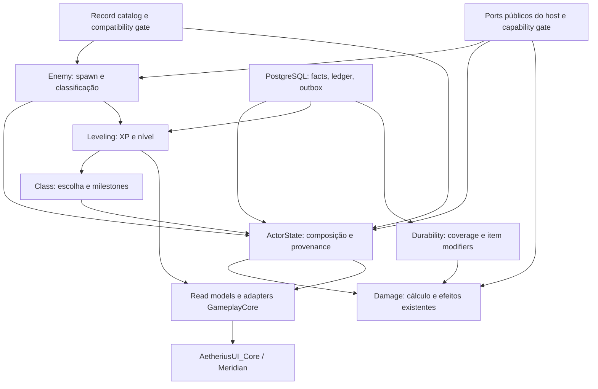

# AetheriusGameplayCore — planejamento holístico

> [!IMPORTANT]
> **Status histórico.** Este documento registra a auditoria e as decisões propostas em 02/10/2026. A partir de 05/10/2026, decisões arquiteturais normativas devem seguir [docs/architecture/AETHERIUS_GAMEPLAY_CORE_ARCHITECTURE.md](docs/architecture/AETHERIUS_GAMEPLAY_CORE_ARCHITECTURE.md). Permanecem válidos aqui os fatos, catálogos, medições, blockers e evidências que não tenham sido substituídos. Foram superadas como regra permanente as proibições de alterar `aetherius-server`/`aetherius-client`: mudanças controladas são permitidas para criar Host APIs públicas, mínimas, versionadas e testadas, mantendo a lógica de gameplay no GameplayCore.

Data: 02/10/2026. Produto: pesquisa, auditoria e especificação; **nenhuma implementação de gameplay nesta entrega**.

Estado: planejamento publicável; ativação autoritativa integral **bloqueada** pelos extension points das bases e pelas verificações de runtime indicadas na seção 70. Instância examinada: `D:\modOrganizer`, perfil `AETHERIUS - GRAFICO - QUALIDADE`.

Convenções: `[REPO]` código lido; `[HOUSECARL]` consulta da instalação; `[RECORD]` valor/override extraído; `[WEB]` documentação externa; `[SKYMP]` base examinada; `[ALDUINAK]` referência consultiva; `[TEST]` execução nesta auditoria; `[INFERENCE]` conclusão ou decisão proposta; `[BLOCKER]` impede o critério explicitado. Uma decisão proposta não é comportamento já implementado. Caminhos de implementação abaixo são relativos ao GameplayCore, salvo indicação explícita de outra baseline.

Os anexos em [docs/audit/2026-10-02](docs/audit/2026-10-02/README.md) fazem parte da especificação. Contagens completas estão nos arquivos estruturados; exemplos no texto não substituem os catálogos.

**Ampliação de mecânicas:** o [manual detalhado](docs/mechanics/README.md) documenta cada uma das 1.493 PERKs extraídas, 1.540 records mágicos ligados, os 71 entry points observados e os estágios das 18 classes. Explica conditions, fórmulas, efeitos, autoridade multiplayer, persistência e testes. Dez PERKs antes truncadas foram reextraídas; os números de truncamento abaixo descrevem a coleta original. O [balanço atualizado](docs/mechanics/10_COBERTURA_DECISOES.md) registra a redução dessa lacuna e os blockers que permanecem.

## 1. Conclusão executiva

O monorepo contém componentes úteis, mas não contém ainda um núcleo integrado em produção. Class e Leveling disputam progressão/propriedade; Damage oferece primitivas nativas sem encaixe demonstrado na base fornecida; Enemy oferece classificação/resolução e contratos sem host integral; Durability mantém cobertura por material e usa SQL de outro dialeto; ActorState é scaffold. UI Core já fornece protocolo, roteamento e revisão reutilizáveis.

A solução proposta é consolidar contratos e catálogo no GameplayCore, preservar `ActorCombatState`, reutilizar `ActiveEffectStore` quando houver capacidade real de execução, e tornar ActorState um compositor com proveniência. Enemy determina identidade, spawn e classificação; Leveling determina XP; Class determina escolha, milestones e grants; Durability fornece modificadores; Damage calcula/aplica combate por uma única autoridade. UI recebe projeções.

Há três incompatibilidades que impedem declarar o conjunto pronto: (a) MO2/cliente/servidor não têm a mesma lista comprovada; (b) APIs nativas exigidas por Damage não estão exportadas na base Server; (c) Client contém remoção global de spells. Na auditoria de 02/10 a especificação não prescrevia patches obrigatórios nas bases. Essa restrição foi posteriormente superada pela arquitetura canônica: quando um extension point público não existir, ele pode ser implementado de forma controlada no Server/Client como Host API versionada. Recursos continuam desligados até que a nova capability esteja implementada, testada e reportada como disponível.

A auditoria percorreu headers de todos os 424 plugins, extraiu 165.372 winners de 24 assinaturas centrais e 10.235 registros adicionais de dez assinaturas, além de campos complementares de quests/factions. Extraiu 33.415 árvores de overrides no conjunto central, 41.665 ocorrências de conditions em 178 funções e 39 archetypes em 5.496 MGEFs. O catálogo é abrangente; a revisão humana aprofundada é priorizada e identificada, não uma alegação de inspeção manual de cada record. Testes de componentes passaram em sua maioria; seis testes Class permanecem falhando. Não houve sessão de gameplay ao vivo.

## 2. Escopo e princípios

Escopo: seis módulos, UI Core, ZIPs Server/Client, load order MO2, mods/DLLs/configurações, PostgreSQL, segurança, rollout e critérios de implementação. O pedido incorporou as instruções técnicas dos anexos; instruções e afirmações históricas encontradas nos repositórios são evidências, não novas autorizações.

Invariantes: servidor decide; estado tem um único owner; toda concessão conhece a origem; forms são estáveis e compatíveis com ESL; winners e camadas runtime entram na compatibilidade; rebuild é determinístico; remoções são por origem; consultas de combate são RAM; mutações duráveis são idempotentes; UI não calcula resultado autoritativo. Ausência de evidência é `unknown`, nunca `supported`.

O requisito adicional de baixo impacto no PC foi incorporado: coleta final sequencial, parsing JSONL em streaming, compressão moderada, sem novas compilações simultâneas. Os testes nativos já tinham terminado quando essa preferência foi comunicada.

## 3. Baselines e SHAs dos repositórios

|Fonte|Identidade examinada|Papel|
|---|---|---|
|GameplayCore|`2b33e41e9e582ed6c66df562722a4a630f729f16`|Único alvo desta entrega e da implementação proposta|
|UI Core|`470526a24a003d5452802f90933c323c3bc4e300`|Dependência de protocolo, shell e ponte nativa|
|Alduinak|`243c8c6b5ee1c7e191e3891daef403bfe28a96bd`|Comparação consultiva; não authority|
|Server ZIP|SHA-256 `b24d928d890bfe1d063cd09aae4aa2a7d5701b977bb9e6e0e48a03aea5681564`|Baseline fornecida; 1.647 entradas|
|Client ZIP|SHA-256 `bebe2058fa407200ad7de9c32be3e4c2700ace5a2f5f924cd829ccf6a5206dda`|Baseline fornecida; 223 entradas|

`git ls-remote` dos dois repositórios AetheriusRP retornou indisponibilidade/“Repository not found”. ZIP não carrega um SHA de commit verificável; não se atribuiu um. Ver [zip-baselines.json](docs/audit/2026-10-02/zip-baselines.json).

`README.md`, `MIGRATION_MANIFEST.md` e `docs/MONOREPO_MIGRATION_POLICY.md` confirmam importação lossless. Origens: Class `2406c3d680c4ceddcea70f7b202deba010af3360` (108 arquivos); Damage `f21faf5c4a1264f787545e20a1e4dbadc6362e80` (52); Enemy `c61031b9d12a6619c0848606901e5b4fabb1c9d5` (66); Leveling `c339797c24345810c478cd1618777d55ff755852` (76); Durability `4146fc89d0c9112bd63c019f0c5fcabe036c4502` (23). O [índice de fontes](docs/audit/2026-10-02/source-index.json) registra hash, tamanho, linhas e símbolos dos 329 arquivos rastreados Gameplay e 44 UI; indexação não equivale a teste de todos os caminhos.

## 4. Restrições da auditoria e política atual

Durante a auditoria de 02/10, Server e Client foram tratados como read-only para separar evidência de implementação. Não aplicar patches históricos ou monkey patches privados apenas para fazer uma feature parecer suportada; as pastas `server/server/cpp` importadas no Damage continuam não sendo prova de capacidade da base.

**Política atual:** Server e Client permanecem repositórios externos ao GameplayCore, porém podem receber mudanças controladas para expor Host APIs públicas, mínimas e versionadas. Essas mudanças precisam de baseline/commit explícito, testes e capability report. Regras de gameplay, ownership, persistência econômica e composição continuam no GameplayCore. Internals privados não são contrato.

Não instalar plugins ou patches MO2 apenas para contornar ausência de capability. Não regenerar/copy-forward conteúdo produzido por DynDOLOD, Occlusion, Synthesis, ParallaxGen ou outputs de animação como fonte autoral.

## 5. Fonte efetiva da load order

`[SKYMP]` No Server ZIP, `server/ts/settings.ts` chama `applyShippedLoadOrder` antes da leitura final. `server/ts/shippedLoadOrder.ts` procura `<dataDir>/aetherius-loadorder.json`; quando existe, valida arquivos e substitui `settings.loadOrder`, preservando backup. `additionalServerSettings` é aplicado depois. `server/cpp/addon/ScampServer.cpp:325` monta os caminhos a partir de `serverSettings["loadOrder"]`, usando absolutos ou `dataDir / elemento`. Essa lista entregue ao loader é a autoridade operacional do processo Server. Manifest gerado a partir de settings é produto, não uma segunda autoridade.

Os scripts `server/tools/sync-client-plugins.js` e `client-plugins.js` podem produzir a lista distribuída. Isso não prova que foram executados no deploy. O ZIP Server contém manifest com cinco masters; as configurações locais encontradas no workspace também listam cinco. O ZIP Client traz perfis qualidade/performance com 424 nomes. MO2 tem 424, mas com diferença: `raysense.esp` aparece no ZIP; `Aetherius - Black Logo.esp` aparece na instância. A diferença desloca posições subsequentes. O Default do cliente tem dez entradas.

`[BLOCKER B01]` Nenhum processo de Skyrim/servidor ativo foi encontrado durante a coleta; não foi obtido dump de `getEspmLoadOrder()` do servidor realmente usado em produção. Portanto, **a load order efetiva da instância MO2 está identificada; a equivalência com produção não está comprovada**. Para liberar F0, colher settings pós-merge e `getEspmLoadOrder()` do mesmo processo/build, hashes dos arquivos realmente abertos e handshake dos clientes; divergência aborta ativação. Não renomear esta amostra MO2 como “snapshot do servidor de produção”.

## 6. Snapshot da load order

`[HOUSECARL]` instância `D:\modOrganizer`; perfil `AETHERIUS - GRAFICO - QUALIDADE`; 550 mods habilitados, 424 plugins; 413 marcados e 11 implícitos. Housecarl `2.0.2+b3b09613bca64e385b43e4b9de1961f0958c0360`, epoch `e2-ad3c01c2aa184e91`; runtime instalado identificado como `1.6.1170.0`.

|Medida|Valor|
|---|---|
|ESM / ESL / ESPFE / ESP|16 / 18 / 287 / 103|
|Full / light|119 / 305|
|SHA-256 loadorder.txt|`d88a4432126a991a1f119e2c33070bc46131d4e9b10b55f6ce85a3ef4feff315`|
|SHA-256 plugins.txt|`d14213c792c55918efb7520235a19eaab075e3cd637d047ae37dfad334daf36e`|
|SHA-256 modlist.txt|`1662c4dee12c0f7c5c7ba35ac057724a28653758027711563bc57cfce078c06d`|
|Assinatura ordenada de nomes/formatos/hashes|`0e02131c15989418643027baff683ff7ce08aa7b9b9eb3fa17c5f5c6c45e6ec1`|

A assinatura acima é a coleta de plugins, **não** a assinatura completa de compatibilidade proposta na seção 61. Arquivo completo: [snapshot.json](docs/audit/2026-10-02/snapshot.json). Mutagen foi consultado para schemas antes da leitura de campos; identidades/winners vieram do Housecarl, não da inferência de offsets de headers.

## 7. Catálogo completo de plugins

[PLUGIN_CATALOG.md](docs/audit/2026-10-02/PLUGIN_CATALOG.md) lista as 424 posições; [plugins.json](docs/audit/2026-10-02/plugins.json) contém masters, flags, hashes, tamanhos, tipos e quantidades; [plugins-matrix.csv](docs/audit/2026-10-02/plugins-matrix.csv) permite filtrar. Nenhum plugin foi eliminado por nome, tamanho ou por ser light.

Foram varridos todos os headers, inclusive tipos visuais fora do catálogo central. A contagem `housecarlGameplayWinners` cobre o conjunto central selecionado, não “todos os records do jogo”. `addedHeaders/overrideHeaders` é contabilidade auxiliar; o grafo autoritativo é o do Housecarl. Um plugin pequeno com um único PERK ou GMST pode exigir blocker de combate.

## 8. Catálogo de mods sem plugin relevante

O [inventário SKSE](docs/audit/2026-10-02/skse-inventory.json) contém 111 DLLs, 993 configs e 29 pastas de configs; 109 declarações modernas, dois arquivos que não são plugins, 107 com Address Library e dois com versões fixas. Metadados de DLL não comprovam carregamento bem-sucedido. [runtime-assets.json](docs/audit/2026-10-02/runtime-assets.json) fixa 1.689 assets loose nas áreas de scripts/SKSE/distribuição; [mods.json](docs/audit/2026-10-02/mods.json) cobre os 550 mods.

Grupos que afetam o contrato: Precision e frameworks de ataque/colisão; BFCO/For Honor/SCAR e contexto de ataque; Dual Wield Parrying e block; Blade and Blunt Armor Rating Scaling e curva de armadura no cliente; Scrambled Bugs e regras de efeitos; SkyPatcher/SPID/KID e distribuição; Skyrim Platform e transporte; Meridian/UI bridge e apresentação. Sua mera presença não concede ao servidor estados como `isPowerAttacking` ou uma prova de colisão.

`[HOUSECARL]` SkyPatcher: oito pastas de tipos, 195 INIs, 190 aplicáveis, 1.364 linhas (1.355 em arquivos aplicáveis), 140 conflitos de SET, zero dead writes intra-arquivo, zero duplicatas entre INIs e um no-op segundo a ferramenta. Regras de filename gate e VFS importam. O [relatório da camada](docs/audit/2026-10-02/skypatcher-layer.txt) distingue condicionais de resolução certa. Não aplicar automaticamente esse overlay ao servidor: o DLL roda no cliente Skyrim, enquanto o loader Server lê plugins. O target exige política explícita de equivalência.

Limites: aviso do Housecarl sobre ausência de `Skyrim.ini` com `sResourceArchiveList`; assets exclusivos em BSAs vanilla podem não aparecer. O inventário loose não enumera todo OAR/HKX sob meshes nem decompila todos os PEX. Esses componentes ficam com status de semântica runtime não certificada; o manifesto de rollout deve incluir seus hashes e validação específica quando participarem de gameplay.

O replay SkyPatcher também informou 70 linhas amplas avaliadas só contra alvos explícitos, 21 alvos explícitos não resolvidos e 43 records alvo sem replay concluído. Assim, os 140 conflitos são achados no escopo avaliado, não uma prova de que não existam outros. Detalhes permanecem no relatório; B06 inclui essas lacunas.

## 9. Pesquisa documental por mod

Foram consultadas pelo conector Nexus do Housecarl **367 páginas de mods**, selecionadas pelo vínculo com plugins contendo tipos centrais ou assets de scripts/SKSE, incluindo dependências e mods pequenos, e não só por popularidade. [mod-research.json](docs/audit/2026-10-02/mod-research.json) registra URL, título, data, metadado publicado e mods instalados associados. Versão disponível na web não substitui versão/hash instalado. Não foi executada atualização de mods.

Intenção documental orienta perguntas: Vokrii exige entrypoints/conditions; Mysticism exige spell/magic semantics; Thaumaturgy exige enchantments; Apothecary exige alchemy; Aetherius exige racial grants; Mundus exige standing stones; Sentinel exige equipamentos/distribuição; packs de inimigos/dungeons exigem resolução e quest safety. As respostas instaladas vêm dos exports, sobretudo dos patches AETHERIUS que vencem autores originais. Cada URL está vinculada no catálogo. Mods locais/outputs sem Nexus ID têm fonte local explícita e não recebem uma página inventada.

Esta pesquisa é de intenção/dependências e cotejo com records; não é auditoria de código-fonte de 111 DLLs nem garantia de compatibilidade de todas as versões publicadas. Conteúdos sem documentação pública suficiente geram lacunas por capacidade, não suposições de “cosmético”.

## 10. Matriz mod × sistema

A matriz integral está em [plugins-matrix.csv](docs/audit/2026-10-02/plugins-matrix.csv). `candidate_domains` indica triagem conservadora por tipos efetivamente encontrados; detalhes semânticos são os campos/árvores e a revisão de patches. O vínculo Leveling→NPC/CELL/QUST representa dependência da classificação/contexto, não XP embutida nesses records.

|Conjunto observado|Class|Damage|ActorState|Enemy|Leveling|Durability|
|---|---|---|---|---|---|---|
|Vokrii + ADXP + fixes + compat patches|grants/milestones|entrypoints|proveniência/skills|perks de NPC|milestones consomem nível|perks ligados ao equipamento|
|Mysticism + Lost Grimoire + compat|spells concedidas|cast/effects|ativos/learned|magias de NPC|efeitos não dão XP por si|staves/equipment gates|
|Thaumaturgy/Artificer|requisitos|ENCH/MGEF|equip grants|loot/equipment|contexto de conteúdo|material não é enchantment|
|Aetherius/Mundus/Pilgrim|baseline e grants|modificadores|race/stone/blessing|race/template|sem nova classificação|sem fórmula paralela|
|AETHERIUS BALANCE/INIMIGOS/LEVELED LISTS|rebuild|winners|baseline NPC|spawn/ECZN/LVLN|Enemy é fonte|equipado do NPC|
|AETHERIUS ITEM BALANCE/Sentinel|equip gate|armor/weapon values|instâncias|outfits/listas|sem XP por nome|material/coverage|
|Dungeon/location patches|contexto|contexto|location|safety e resolução|eligibilidade/relevância|contexto de ciclo|
|DLLs/INIs/animação|projeção|eventos/curva local|contexto validado|AI/controle|nunca prova de morte|nunca débito por pacote|

## 11. Mapa de patches

[override-summary.json](docs/audit/2026-10-02/override-summary.json) e `override-trees.jsonl.gz` registram providers, tipos e diferenças de campos selecionados. A comparação de cada nó é **contra o winner final**, não contra o predecessor. Portanto, `differentFromFinalWinner=0` no winner não significa ITM. Deltas de listas podem ser abreviados pela ferramenta; valores completos dos winners estão em `winning-fields.jsonl.gz`. Os seis PERKs ADXP têm before/after completos à parte.

|Plugin|Registros em árvores centrais|Evidência de alcance e consequência|
|---|---:|---|
|Vokrii - ADXP Patch.esp|6 PERK|Revisão manual seção 12; muda dano e conditions, não só animação|
|Vokrii - Apply Spell Conditions Fix.esp|27 PERK + 157 SPEL|Conditions precisam ser lidas no winner e em cada efeito aplicado|
|Mysticism - Vokrii Compatibility Patch.esp|223|PERK16, SPEL86, MGEF55, ENCH64, FLST1, AVIF1; vários têm override posterior|
|Vokrii - Thaumaturgy Compatibility Patch.esp|3 PERK|Efeito de perk/enchantment pertence à mesma cadeia de cálculo|
|LostGrimoire_Vokrii_Patch.esp|13|SPEL1/MGEF6/ENCH3/FLST3; lista também faz parte do catálogo|
|PilgrimVokriiMysticismPatch.esp|16|PERK1/SPEL4/MGEF5/KYWD4/AVIF2; AVRestoration termina aqui|
|AETHERIUS - INIMIGOS.esp|43 NPC|Baseline/template efetivos devem alimentar Enemy e NPC combat state|
|AETHERIUS - BALANCE.esp|697|SPEL181/MGEF171/RACE24/ECZN319/INGR2; inclui charge time e equip type|
|AETHERIUS - ITEM BALANCE.esp|9.231 ARMO|Balanceamento efetivo é o winner, não rating do mod original|
|AETHERIUS - LEVELED LISTS.esp|2.183|NPC1195/LVLN53/LVLI932/AMMO3; invalida pools e equipamento derivados|
|AETHERIUS - WORLD EDITS.esp|27|CELL23/WRLD4; contexto e segurança devem usar esses winners|

Exemplos conferidos: `07A82B:Skyrim.esm` FireStorm tem charge time final 6 versus 1,5 em um predecessor; `07E8DA` Mayhem e `07E8DB` Harmony têm equipamento `013F45:Skyrim.esm` e charge time 6 no balanceamento, em vez de `013F44`/1,5 da compatibilidade. Em RACE, diferenças de body slots entre Aetherius/Racial Body Morphs/BALANCE não podem ser confundidas com mudança em grants; algumas listas `ActorEffect` só mudam ordem. O grafo distingue esses casos.

## 12. Auditoria manual do Vokrii ADXP Patch

`[RECORD]` O arquivo instalado está presente e é winner das seis identidades abaixo. Comparação direta `source=Vokrii - Minimalistic Perks of Skyrim.esp` versus winner, profundidade oito, mais árvores de providers. Ver [diff completo](docs/audit/2026-10-02/vokrii-adxp-diff.json) e exports before/after comprimidos.

|Form estável Housecarl|EditorID / intenção efetiva|Mudança que o executor precisa respeitar|
|---|---|---|
|`03AF9E:Skyrim.esm`|`VKR_Two_090_Sweep_Perk_WasSweep`|Remoção da restrição direcional por `IsAttackType`; power attack permanece; `SetSweepAttack`, `ModPowerAttackDamage` e `ApplyCombatHitSpell` continuam com prioridades próprias|
|`106256:Skyrim.esm`|`VKR_One_030_DualFlurry1_Perk_WasDualFlurry1`|Sai a concessão anterior de velocidade; efeito vencedor `ModAttackDamage` multiplica por **1,1**, com gates `GetEquippedItemType`|
|`106257:Skyrim.esm`|`VKR_One_030_DualFlurry2_Perk_WasDualFlurry2`|Equivalente rank seguinte, multiplicador **1,2**; não somar automaticamente ao rank anterior|
|`4F3346:Vokrii - Minimalistic Perks of Skyrim.esp`|`VKR_Two_060_Warmaster_Perk`|Elimina direção frontal; mantém power attack, aplicação de spell e critical gates por `HasMagicEffect`; critical damage 2 e chance 100 no ramo condicionado|
|`4F335F:Vokrii - Minimalistic Perks of Skyrim.esp`|`VKR_One_060_CraterMaker_Perk`|Elimina direção frontal; preserva aplicação condicional e critical damage 2; não equivale a crítico garantido em todo hit|
|`4F3360:Vokrii - Minimalistic Perks of Skyrim.esp`|`VKR_One_090_DisarmingSlash_Perk`|Elimina restrição lateral; mantém power attack/efeitos condicionais; exige executor de disarm e provenance do spell aplicado|

As descrições foram conferidas com entrypoints e CTDAs, não usadas como implementação. Listas de efeitos são reordenadas: uma diferença em `Effects[0]` não prova remoção sem comparar `EntryPoint/Rank/Priority` e conditions. `Parameter1.Index` pode mostrar número codificado diferente por contexto de plugin, enquanto `Parameter1.Link` resolve à mesma identidade; não persistir aquele índice nem tratá-lo como mudança semântica.

Keywords de material/arma, `RunOnTabIndex`, operadores e ORs permanecem no before/after. Testes devem cobrir mãos elegíveis/não elegíveis, power/normal, efeito marcador presente/ausente, rank e ataque autorizado. Como o runtime Damage atual só certifica um subconjunto de perks, estes seis **não estão automaticamente suportados** por haver nomes no ClassSystem.

## 13. Grafo de overrides

`override-trees.jsonl.gz` contém 33.415 identidades contestadas, cada uma com `touchers`, `reference` final e nós de providers. O restante dos winners centrais tem provider único. Não há paginação perdida: 140 lotes, no máximo 240 identidades por lote, somam o total; retomada após redução de paralelismo preservou os lotes concluídos.

Exemplo: defining master Skyrim → Vokrii → ADXP para os perks vanilla alterados. Para Restoration AVIF, a compatibilidade Mysticism/Vokrii é intermediária e Pilgrim é winner. A arquitetura deve indexar `definedIn` e `winningProvider` separadamente e registrar todos os providers em auditoria. Uma dependência de source provenance de gameplay (CLASS/RACE etc.) é outro eixo; o plugin vencedor não informa quem concedeu a perk a um ator.

## 14. Winning records críticos

`winning-records.jsonl.gz` fixa identidade, tipo, EditorID, winner, runtime ID observado e profundidade de override. O runtime ID é evidência deste snapshot, **não um formato de persistência proposto**. `winning-fields.jsonl.gz` guarda fatos extraídos e origem da extração; múltiplas linhas de um mesmo form são projeções complementares, não versões concorrentes.

Conjunto central: CELL74.441; ACHR17.850; ARMO11.926; NPC11.582; LVLI9.051; WEAP7.736; COBJ5.841; MGEF5.496; SPEL3.791; QUST3.139; KYWD2.199; LVLN2.173; FLST1.720; FACT1.711; GLOB2.085; ENCH1.494; PERK1.493; ALCH524; ECZN402; RACE241; INGR183; AVIF149; AMMO88; WRLD57. Os GLOB são 1.702 short, 363 float e 20 int.

Adicionais incluem SCRL404, PROJ455, HAZD138, OTFT1.382, CSTY297, LCTN1.007 e GMST1.671, mais ACTI/CONT/DOOR. Quests/factions tiveram campos próprios complementados. Nem todo campo de todos os tipos foi extraído; links opacos/arrays limitados estão no relatório de cobertura e devem impedir certificação do record dependente até expansão focal.

Integridade Housecarl: 1.100 links pendentes, dos quais 398 atribuídos a plugins base e 702 aos demais; nenhum master ausente e nenhum plugin não varrível nessa execução. Exemplos de origem: Man-at-arms273, ITEM BALANCE71, ForswornHeaddress62. Não confundir achado de resolução com crash reproduzido; isolar se o campo é alcançável pela feature. Não corrigir automaticamente durante planejamento.

## 15. Auditoria do GameplayCore

Não existe bootstrap único, pacote comum de contratos, transação interdomínio, assinatura conjunta ou readiness unificada. Há TS, JS/CJS/ESM e C++ com testes próprios. A preservação lossless explica duplicações, mas não autoriza executá-las juntas. Mover pastas antes de fixar ownership criaria regressões sem resolver a integração.

`[TEST]` Enemy: 77 passaram, cinco skipped de 82; Leveling: 44 passaram; Durability: 11; Damage TS: seis; Damage C++: dois executáveis CTest Debug passaram; UI: 14. Class com seu `pretest` oficial: 44 passaram e seis falharam em 50. Logs e comandos em [VALIDATION.md](docs/audit/2026-10-02/VALIDATION.md). Componentes com testes verdes não equivalem ao addon completo integrado.

Class falha em expectativas de resolução/quantidade de perks e em dois fluxos legados de XP/dedupe. A primeira execução direta de Jest omitiu pretest e teve resultado diferente; a baseline reportada é `npm test` completo. O arquivo de UI gerado pelo pretest foi restaurado ao conteúdo versionado; não se inclui mudança de produto nesta entrega.

## 16. Auditoria ClassSystem

Arquivos centrais: `modules/class-system/server/index.ts`, `classSystem.ts`, `levelingSystem.ts`, `shared/skillResolver.ts`, `combatProfileAdapter.ts`, `storage/playerRepository.ts`, `partySystem.ts`, `raidSystem.ts`, `uiModule.ts`, `client/clientPerkApplier.ts` e dados/mappings. O índice de fontes resolve nomes exatos e hashes.

O repositório mantém estado em Map por playerId e projeta em `playerClassData`; falhas de `mp.set` podem ser logadas sem abortar o save. Publicação de perfil pode preceder atualização durável. Não é transação. O adapter gera perfil com 18 skills, range 0..100, revisão maior que a armazenada/nativa e grants classificados somente como CLASS. Isso é ponto de extração, não razão para criar outra implementação.

Skills vêm de regras textuais/classes; “Todas” aplica às skills primárias da classe. Cliente faz atribuição exata do valor calculado em determinados fluxos, não apenas floor apesar de comentário. Atributos com fallback racial 100 não substituem RACE vencedor. A aplicação de perks controla seu conjunto em memória; removê-lo difere de remover todas as perks do ator, mas perde provenance após restart.

Há 18 classes, 350 ocorrências de perks em estágios e mapping de 162; testes ainda esperam 351 em um caso. Mapping nominal não é prova de que o entrypoint está implementado. Seleção repetida da mesma classe pode passar pelo guard que só rejeita classe diferente e reinicializar progressão; target exige idempotência e comando separado de reset.

O leveling embutido e `reportCombatKill` recebem identificação/nível/contexto de vítima sem prova nativa de morte; TTL por player/vítima não distingue gerações. O cliente legado usa `mp.events.callRemote`, incompatível com assumir a API real desta base. Não expor esse caminho no bootstrap integrado. Party guarda convites/membros na RAM, usa valores iniciais de recursos/posição ilustrativos e limite oito; Raid exige oito para converter, expande a vinte e subgrupos 1..4 de cinco. Preservar regras de capacidade, mas trocar identidade transitória, snapshots e validação inteira/finita; não aceitar posição do read model como prova de XP.

## 17. Auditoria DamageSystem

Preservar `state/ActorCombatState.h`, `effects/ActiveEffectStore.h`, `providers/CombatProviderRegistry.h`, `forms/StableFormKey.h`, `stats/CombatStatsCache.h`, `physical/PhysicalDamagePipeline.h` e `magic/MagicDamagePipeline.h`. Estão em `modules/damage-system/server/server/cpp/server_guest_lib/aetherius_combat/`. `AetheriusDamageFormula.cpp` depende de métodos como `MpActor::GetCombatState` fornecidos pelo patch histórico, ausentes na base examinada.

Físico atual compõe base+flat, multiplicador de item, `1 + .005 * skill`, perks, ataque autorizado e crítico antes de defesas. Armor aplica rating/skill/perks por peça mais hidden armor; block é capped. `CalculateDamage(SpellCastData)` lança explicitamente “runtime integration pending”; não está ativo o pipeline mágico completo. Armor encantada também é rejeitada até resolver ENCH/MGEF. Armas iguais pelo mesmo base ID geram erro por faltar seleção de instância. Provider recebe `instanceId` vazio nesse caminho. Estado de ambos os atores com revision é obrigatório; NPC precisa dele.

Flags de power/sneak/bash do pacote não concedem bônus; isso é correto, mas falta fonte autorizada para liberar tais features. Block cruza observação do pacote com estado do defensor. Base de crítico em helper não demonstra preenchimento completo no adapter. Não anunciar suporte a munição/enchantments/dual instances sem golden do caminho integrado.

`ActiveEffectStore` tem instâncias, limite 4.096, policies Coexist/Add/Strongest/Latest/RefreshDuration/MaxN/UniqueSource e scheduler. Persistência exclui concentration, mas salva `sourceActorId` bruto: precisa de ActorKey estável e binding de sessão. `ActiveMagicEffectsMap` da base é por ActorValue, sem a mesma semântica. A seção 34 define migração/exclusividade, sem terceiro store.

## 18. Auditoria ActorState scaffold/gaps

Só existe scaffold; não há store autoritativo pronto. Não implementar um novo `CombatProfileStore` e outro `ActiveEffectsStore` em TS. ActorState deverá possuir fatos duráveis de ator/grants e orquestrar providers, referenciando as estruturas de combate existentes por ports.

Faltam ActorKey estável, source ledger, import legado idempotente, conjunto de learned spells, escolhas race/stone, transições de transformação/doença, reconciliação de equipment grants, agregação de skills/atributos e revisão consistente. Cada função deve responder de quem é o dado e se a API nativa consegue consumir a projeção. Não inventar suporte ao host para completar o scaffold.

## 19. Auditoria EnemySystem

O módulo já contém scanner/catalog, stable forms, winning override resolver, classifier/registry, dungeon rules, spawn resolution, quest safety, eventos e bridge. Deve fornecer a classificação única consumida pelo Leveling. Scanner de arquivo e fallback que agrupa por localFormId+tipo não equivalem ao winner do Housecarl: IDs iguais em masters distintos podem colidir. Converter para identidade com defining master antes de agrupar.

Heurísticas de família por keywords/factions e nomes precisam de proveniência. Mapeamentos genéricos animal/werewolf→Wolf ou spriggan→Warlock e dungeon MEDIUM default não são fatos do record. Dragon priest nível 100 é regra de política: o winner `02025A:Skyrim.esm` (EncDragonPriestFire) tem nível 70, Health 1.690 e Magicka 645 em AETHERIUS INIMIGOS, contra nível 50/Health 1.490/Magicka 545 no predecessor Humanoid Dragon Priest. São valores de campos base, não máximos efetivos após todos os providers. Templates, NPC level offsets, ECZN, listas e geração devem ser resolvidos sem perder o original.

Seleção ponderada determinística já é útil; seed, pesos, pool e generation entram na evidência. Pool vazio falha fechado. Quest safety precisa avaliar quest-critical/alias/script antes de exceção boss+unique, pois a ordem atual pode permitir registros especiais antes da barreira. “Servidor sem quests” em documentação histórica não é autorização para ignorar VMAD/aliases. Persistência por callback opcional e cache sem assinatura completa não bastam para restart seguro.

## 20. Auditoria LevelingSystem

XP/progression/relevance/fatigue/party/readiness/ledger já estão separados em `src`. A configuração efetiva é **classLevel 1..40**, 15 pontos por nível, máximo 585 e XP acumulada 1.848.000 até 40. Apesar do desejo de “XP global”, o código atual não mantém progressão independente de classe.

`XpAwardService` pode usar repositórios/dedupe/ledger em memória; readiness de authority e coverage é fail-closed quando não ligada. `SkyMpPlayerProgressionRepository.transaction` lança sem primitive atômica do host: não fingir atomicidade. O fluxo síncrono por destinatário não pode simplesmente receber driver PostgreSQL assíncrono. Claim, commit de estado, ledger e publicação separados deixam janelas; liberar claim após estado commitado pode duplicar XP no retry.

Decisão proposta: Leveling é owner de `characterLevel/totalXp`; migração inicial preserva a curva e o nível legado **sem reset por troca de classe**. `classMilestoneLevel = characterLevel` é projeção de Class nesta versão, sem segundo saldo de XP. Mudança econômica futura exige config versionada e migração explícita; não reinterpretar históricos automaticamente. Importações com `level`/`classLevel` divergentes vão para quarentena de reconciliação, não `max()` silencioso.

Party atual usa multiplicadores 1→1, 2→.9, …, 8→.6; raid 8→.6 a 20→.4. Mesma célula, online, distância até 5.000 e sem exigência de contribuição de dano são regras versionadas atuais. Campos `source: SERVER` em payload não autenticam origem; posição com NaN deve ser rejeitada. Fixed XP possui tratamento separado de modifiers/fatigue: preservar a política declarada, testar e não aplicar redução duas vezes.

## 21. Auditoria DurabilitySystem

O domínio é **manutenção/cobertura por personagem, categoria e material**, não porcentagem de desgaste em cada item. `maintenance-service.js`, `material-catalog.js`, `persistence.js` e `sky-mp-bridge.js` contêm regras, consumo e ponte. Kits/cargas financiam cobertura por ciclo; `getMultiplier` retorna neutralidade quando há cobertura/saldo e penalidade quando ausente.

`_consumeForKey` pode aguardar persistência no primeiro evento eficaz e salvar ciclo em eventos subsequentes. Não conectar esse async diretamente ao cálculo nativo de cada hit. `authorize` default permissivo deve ser substituído por capability obrigatória. Timestamp/authority de evento não podem vir da UI. Locks em Map precisam de lifecycle/limite.

`SqlMaintenancePersistence` usa `getConnection`, placeholders `?` e `ON DUPLICATE KEY UPDATE`: é dialeto MySQL, não PostgreSQL. A migration existente não é migration PG reutilizável. Mutação direta em `character_inventory` não prova atomicidade com inventário nativo em RAM. Ledger SQL de requestId global difere do escopo por personagem em memória e não valida reutilização com payload diferente. A seção 49 define escrow/port e bloqueia consumo até uma interface segura de inventário existir.

## 22. Auditoria AetheriusUI_Core

`shared/protocol.ts` valida envelope V1, limite 16 KiB, profundidade 16, arrays até 256, números finitos e chaves perigosas. Router recebe actor de contexto de transporte, exige capability e vincula sessão. Cache de respostas 512/120s não reserva execução em andamento: dois requests simultâneos podem entrar antes do cache. GameplayCore deve aplicar idempotência durável por comando, mesmo com dedupe de UI.

Revision store rejeita snapshot antigo; patch exige base revision correspondente e solicita resync em gap. Cópia vendorizada Class diverge da versão atual em revision handling; unificar import pinado após caracterização. SDK registra módulos, lifecycle e slots; adapters pertencem ao GameplayCore.

Ponte `native/src/main.cpp`: Meridian View/Input consultados em `kInputLoaded`, views em `kDataLoaded`, chamadas de UI transferidas à task queue. `AetheriusUI.FromView` transporta pedidos; `AetheriusUI.ToView` entrega; limite nativo 18 KiB não relaxa o protocolo 16 KiB. Mod event com string `source=server` continua sendo apresentação local, não autenticação servidor. Não certificar AE/SE/VR apenas pelo query de versão ou pelos metadados; não compilado/executado este DLL nesta auditoria.

## 23. Auditoria read-only Aetherius-Server

Exports comprovados em `server/cpp/addon/ScampServer.cpp`: get/set, makeProperty/makeEventSource, ponte Papyrus, custom packets, descritores/IDs e load order. Ausentes os exports de apply/get combat profiles esperados pelo Class/Damage e a troca autorizada de damage formula. O module registry JS tem lifecycle, mas não é um event bus de combate nem um resolvedor topológico robusto de dependências.

Entry gamemode configurável é caminho externo possível. `requireUncached` limpa estado e usa cópia temporária; bootstrap deve resolver imports por caminhos absolutos e possuir dispose/epoch. Reutilizar base gamemode só via entrypoint público e contrato de boot; não importar singletons privados esperando compartilhar identidade entre bundles.

`core/hit-events.js` chama o próprio sinal de “evidência, não enforcement”. `death-service.js` usa indícios/heurísticas; isso não é morte nativa autenticada suficiente para XP exatamente uma vez. ActorValues e inventário existentes continuam owners enquanto não houver cutover de capacidade demonstrado. Propriedade persistida nativamente não cria uma transação com PostgreSQL.

## 24. Auditoria read-only Aetherius-Client

`GamemodeEventSourceService` recebe código do servidor, passa por `ServerJsVerificationService`, cria contexto com `ctx.sp`, `state` e `sendEvent`; este envia `CustomEvent` reliable pelo emitter interno. Contextos antigos ficam expired e sendEvent vira no-op. `blockedEventSources` e `disable-gamemode-updates` podem impedir updates; adapter precisa testar esses estados e limpar listeners.

`remoteServer.ts:456–465` agenda, para o próprio ator com `learnedSpells`, remoção de cada spell atual e reaplicação da lista após um segundo. Isso viola preservação universal de fontes externas. Reaplicar grants depois reduz divergência visual, mas não garante que nunca houve remoção nem restaura ownership original. `[BLOCKER B03]` não habilitar strict spell ownership nessa baseline.

`SpApiInteractor`/controller privado não é API compartilhável por instalar um bundle separado. Caminho candidato comprovável é `makeEventSource`/property update com verificação de código, ou plugin Skyrim Platform independente somente para APIs públicas. Cliente só captura intenção e mostra projeção; não manda “skills finais”, XP, lista autoritativa de perks ou valor de dano.

## 25. Comparação consultiva com Alduinak

`[ALDUINAK]` SHA fixo na seção 3. `skymp5-server/cpp/server_guest_lib/formulas/AlduinakDamageFormula.cpp` mostra integração nativa concreta com `AlduinakHitRules`, `ItemRowResolver`, `MagicRules`, `DurabilityRules`, tempering e cache de race. Procura arma worn, trata mão direita, usa munição do disparo quando disponível e fallback worn, limita temper ao melhor item possuído e distingue NPC. São exemplos úteis de contexto autorizado e adapters.

Não copiar balanceamento por profession/rows, defaults de raça, IDs ou regras de condição sem cotejo com nossos winners. O fallback de melhor cópia por base ainda não equivale a identidade inequívoca de duas instâncias; não promovê-lo a contrato alvo. A integração exige mudanças internas no fork Alduinak: sua existência não cria APIs na base Aetherius fornecida. Reutilizar ideias de teste e separação de regras, não assumir portabilidade binária ou autoridade de catálogo.

## 26. Gaps do SkyMP relevantes

|Capacidade necessária|Evidência atual|Consequência|
|---|---|---|
|Perfil combat nativo de player/NPC|Não exportado no ScampServer examinado|Damage ativo bloqueado B02|
|Morte, attacker e generation autorizados|Hit/eventsource é client evidence|XP por kill bloqueada B04 até death port seguro|
|Active effects por instância/proveniência|Base por AV; store novo não ligado|Sem coexistência de owners; subset off|
|Conditions da instalação|178 funções observadas; factory base registra 17 handlers|Certificação por record/capacidade, não por nome de função|
|Inventory instance e débito atômico|Bridge de manutenção sem essa garantia|Consumo de kit bloqueado B05|
|Spell reconciliation por origem|Cliente remove todas em caminho observado|B03|
|Template/leveled spawn/quest safety|Dados catalogáveis, host parcial|Enemy começa shadow/read-only|
|Overlay runtime igual ao servidor|SkyPatcher só no Skyrim não prova overlay Server|B06|

Os 17 handlers base incluem 14 convencionais e três Skymp específicos. `Condition::FromCtda` pode produzir nome vazio para função não registrada e traduz RunOn limitado; isso não implementa automaticamente as funções faltantes. A nova engine deve representar Unsupported e evitar “unknown vira true”.

## 27. Duplicações do monorepo

[exact-duplicates.json](docs/audit/2026-10-02/exact-duplicates.json) identifica 12 grupos byte-idênticos; nomes semelhantes não são tratados como iguais. Decisões:

|Duplicação/conflito|Owner escolhido|Migração|
|---|---|---|
|combatProfileAdapter Class e cópia Damage|ActorState composition, com port Damage|Uma implementação; wrappers temporários com deprecation|
|verified-perks/configs derivados|Record catalog/build|Gerar uma vez com hash; consumidores imutáveis|
|Leveling embutido Class e módulo Leveling|Leveling|Desativar award antigo antes de habilitar novo|
|Enemy bestiary/classificadores em Class/Leveling|Enemy catalog|Adapters consomem EnemyDescriptor; sem regex local|
|UI router/protocol vendorizados|UI Core dependência pinada|Caracterização, import único; revisionStore requer merge semântico|
|playerClassData e progresso Leveling|PostgreSQL/Leveling + Class facts|Read model legado somente, sem segundo writer|
|ActiveMagicEffectsMap / ActiveEffectStore|Owner único por capability no cutover|Não criar terceiro store; manter legado se native port faltar|
|skills client/server|Class definition + ActorState effective projection|Client apenas aplica snapshot aprovado|

Dados de UI gerados não são necessariamente duplicação ruim: podem ser build artifacts, desde que derivados e sem autoridade. NÃO apagar cópias antes de remover consumidores e preservar testes de compatibilidade.

## 28. Dependências internas atuais

Class lê/escreve PlayerRepository e leveling interno; combate é porta opcional. Damage importa réplica Class para preparar perfil. Enemy expõe contratos consumidos por integração Leveling, porém callbacks/fixtures não provam conexão com host. Durability usa protocolo próprio e ponte nativa de inventário ausente. ActorState não coordena nenhum deles. UI Class já usa router; manutenção ainda tem UI/protocolo próprios.

O acoplamento perigoso é por efeitos colaterais (mesma propriedade, mutações client, patch de base), não só por imports. O target corta writes paralelos primeiro, depois move contratos. Circularidade a evitar: Damage→Class→Leveling→Damage e Enemy→Leveling→Enemy. Events de fatos pós-commit substituem chamadas recursivas; queries em RAM continuam portas diretas.

## 29. Arquitetura-alvo do GameplayCore

Criar somente estruturas justificadas: `shared/contracts` para identidade/revisões/eventos divergentes; `shared/record-catalog` para evitar seis scanners; `shared/persistence` para transação única; `runtime/bootstrap` para readiness/lifecycle; adapters do host/UI para não editar bases. Reaproveitar ProviderRegistry e stores Damage, classifier Enemy, policies Leveling e catálogo de material Durability. Não adotar broker distribuído ou event sourcing integral sem necessidade observada.

Deploy inicial é um processo autoritativo por world/shard com atores vinculados a sessão e generation. Worker assíncrono cuida de DB/outbox fora do hot path. Vários processos exigem lease/fencing por ator e shard; não assumir que Map é lock distribuído. Nenhuma feature sai de shadow porque outra tem testes verdes.

## 30. Matriz de ownership

Owner significa único módulo autorizado a alterar o fato; composição/projeção pode ter outro responsável. Ports não transferem ownership implicitamente.

|Estado|Owner de escrita|Consumidores|Tipo / guarda|
|---|---|---|---|
|Account/character identity|Host identity adapter|Todos|Persisted externo; Gameplay guarda FK/opaco|
|ActorKey ↔ session actor ID|Runtime binding|ActorState/Enemy/Damage|Runtime; epoch/generation|
|Classe selecionada/reset autorizado|Class|ActorState/UI|Persisted; revisão/CAS|
|XP total, nível, pontos ganhos|Leveling|Class/UI/ActorState|Persisted; ledger único|
|Alocação de pontos|Class|ActorState/UI|Persisted; orçamento Leveling|
|Skills base de classe|Class definitions|ActorState|Definition; versão/hash|
|Skills efetivas e máximos|ActorState compositor|Damage/UI/client projection|Derived; nunca editar diretamente|
|Race/stone selecionados|ActorState choice service|Grant providers/Damage|Persisted; whitelist catalog|
|Grants CLASS/RACE/STONE/QUEST/etc.|ActorState grant ledger, via provider autorizado|Damage/spell projection/UI|Persisted ou derived conforme fonte|
|Learned spell permanente|ActorState acquisition service|Projection/casting|Persisted; prova de aquisição|
|Definitions PERK/SPEL/MGEF/etc.|RecordCatalog|Todos|Definition imutável por assinatura|
|ActorCombatState|Estrutura existente Damage; escrita via composition port|Damage|Runtime/Derived; revision tuple|
|ActiveEffectInstance|ActiveEffectStore existente Damage após cutover|ActorState views/conditions/UI|Runtime; subset persistível|
|ActiveMagicEffectsMap legado|Host, enquanto legacy mode|Base runtime|Runtime; exclusividade por feature|
|Current health/magicka/stamina|Host resource port; depois Damage somente se host delegar|ActorState views/UI|Runtime com checkpoint se suportado|
|Inventory/ownership de instância|Host inventory service|Equipment/Durability/crafting|Persisted externo + RAM; não segunda cópia autoritativa|
|Equipment snapshot|Host equipment adapter|ActorState/Damage/Durability|Derived do inventário autorizado|
|Tempering/enchantment de instância|Host crafting port / serviço autoritativo existente|Damage|Persisted externo; blocker se inexistente|
|Material classification|Durability definition provider|Maintenance/Damage|Derived do catálogo/keyword rules|
|Kit balance/cycle coverage|Durability|Damage/UI|Persisted e projection RAM|
|NPC definition/template result|Enemy|ActorState/XP|Definition + Derived|
|Spawn identity/generation/resolution|Enemy, executado pelo spawn port|Damage/Leveling|Persisted por mundo/geração|
|Enemy family/tier/dungeon class|Enemy|Leveling/UI|Derived com rule provenance|
|Morte autorizada e crédito primário|Native death port|Enemy/Leveling|Fato Runtime durabilizado no ledger|
|Party/raid membership e liderança|Class party service inicialmente|Leveling/UI|Runtime de sessão; revision|
|Party reward snapshot|Leveling, a partir de Party+Host|Award transaction|Persisted no ledger|
|Fatigue por conteúdo|Leveling|Award policy/UI|Persisted; clock servidor|
|UI revisions/read models|Gameplay UI projection|UI Core|Derived; sem comandos de gameplay inversos|
|Transport/session capabilities|Runtime/security adapter|Command router|Runtime; não confiar em payload|
|Feature flags/compatibility epoch|Bootstrap operator config|Todos|Definition; auditada|

## 31. Persisted × Derived × Runtime × Definition

**Persisted:** escolhas, XP, allocation, learned acquisitions, grants de quest adquiridos, idempotency, cobertura reservada, spawn resolutions duráveis e efeitos cujo contrato autorize sobrevivência ao restart. **Derived:** grants automáticos de race/class/equipment, skills, máximos, armor, resistance, enemy tier, read models. **Runtime:** binding, leases, timers, concentration, combat context, recursos correntes e caches. **Definition:** winners, CTDA AST, templates, curves, material mappings, ability recipes e balance version.

Persistir derived só como checkpoint com input signature/revisions; descartá-lo quando divergente. Não usar checkpoint como fonte concorrente. Auto-grants podem ter linhas de ledger para provenance/auditoria, mas são reconciliáveis a partir da escolha+definition; uma spell aprendida não pode ser reconstruída só da load order. Recursos correntes ao mudar máximo: preservar valor absoluto e clamp a `[0,newMax]`, salvo operação explícita de heal/reset com causa. Não curar a cada resync nem converter aumento de máximo em refill oculto.

## 32. Identidade estável de forms

Canonical interno: `{plugin: lowercase basename, localId: six uppercase hex}`; string wire `plugin.esp:012ABC`. Corresponde ao `StableFormKey` existente Damage, com validação compartilhada. Aceitar ESM/ESP/ESL, reject path traversal, nulo e ID fora de 24 bits. Para plugin light, validar faixa permitida conforme record real/versão; não extrair `FE` runtime e salvar como localId. Referência compactada/renomeada exige migration explícita, nunca remap por EditorID automático.

Codecs isolados: Housecarl `012ABC:Plugin.esp`; Enemy histórico `Plugin.esp|012ABC`; host FormDesc `<hex>:Plugin`; todos normalizam ao mesmo objeto. `definedIn` é o master que possui o ID, `winner` é metadado de definição. Runtime resolver usa loader/master mappings e tabela ESL; roundtrip form→runtime→form deve preservar identidade com load orders reordenadas. Dinâmicos `FF` são Actor/Item identities, não StableFormKey persistível.

ActorKey: player `character:<opaque-stable-id>`; NPC colocado `world:<world-id>/ref:<StableFormKey>/generation:<n>`; summon `world:<id>/summon:<uuid>`. Binding contém sessionEpoch + runtimeActorId e é descartado em reconnect. ItemInstanceKey é UUID/ID do owner inventário, nunca só baseForm nem índice de array. IDs de evento/DB são serializados como strings quando ultrapassam safe integer JS.

## 33. Grant/provenance model

Grant: `grantId, actorKey, formKey, kind, sourceKind, sourceKey, sourceRevision, rank, acquiredAt, expiresAt?, definitionSignature, enabled`. `kind` separa PERK, LEARNED_SPELL, ABILITY, POWER; `sourceKind` enum CLASS/RACE/STANDING_STONE/QUEST/ITEM_ENCHANTMENT/TRANSFORMATION/DISEASE/LEARNED/NPC_DEFINITION/LEGACY_IMPORT/ADMIN. Provider registrado só pode alterar seu namespace; ADMIN exige motivo/audit capability.

Chave idempotente `(actorKey,sourceKind,sourceKey,formKey,kind)`; desired grants reconciliados por sourceRevision. União por form: retirar CLASS não remove uma spell também concedida por QUEST. Rank efetivo é política do tipo (normalmente maior rank elegível, não soma cega); conservar todos os grants originais para explicar decisão. Equipment grant usa instanceId+slot e some ao desequipar apenas essa origem. Spell aprendida permanece aprendida mesmo quando outra fonte a concede temporariamente.

MGEF é definição de comportamento, não rótulo de ownership. Uma mesma MGEF pode estar em potion, spell, race ability e enchantment; registrar cadeia `grant → spell/enchantment/ingestible → effect slot → MGEF → active instance`. Remoções direcionam source/grant/instance, nunca “todo MGEF X de qualquer origem”.

## 34. ActorState model

`ActorAggregate` guarda identity, persisted choices e grant ledger; expõe `compose(inputRevisions)` para derivar skills, atributos máximos, perks/spells efetivos e context flags. Inputs vêm dos owners; saída é `CombatProfileProjection` para **ActorCombatState já existente**, além de `ActorReadModel`. Race/stone/equipment não criam stores de efeitos próprios.

ActorState mantém um handle `ActiveEffectsPort` para o store existente. No modo legacy, só observa via capacidade disponível e não escreve efeitos equivalentes. No modo integrated, o cutover precisa provar que a base deixou de aplicar aquele conjunto de efeitos e que o Damage store é a única autoridade. A feature inteira permanece bloqueada se isso não puder ser garantido por port público. Nenhum TS mirror mutável serve como terceiro store.

Revisions: `{catalog, actorFacts, grants, equipment, effects, providers, context}`; uma mudança invalida somente projeções dependentes. Compose puro, sem DB e sem UI; rejeita referências não resolvidas, valores não finitos e inputs de épocas misturadas. Publicação de perfil é atômica por ator; se host rejeitar, readiness desse ator fica false e comando persistido permanece para retry idempotente, sem conceder combate parcial.

## 35. Skills model

Todas as 18 skills devem existir no snapshot. DefinitionClass contém números compilados das regras atuais; eliminar parsing de texto de apresentação no hot path. Separar `classBase`, `raceBaseline`, `permanentModifiers`, `temporaryModifiers`, `effective` e provenance. Decisão inicial: preservar a base exata de classe; racial skill boosts entram como componente explícito versionado, sem somar de novo se a baseline já os absorveu. Migração deve registrar qual representação recebeu.

Cap/clamp conforme config atual 0..100 para perfil combat; valores fora da faixa não são aceitos silenciosamente. Skills profissionais/futuras têm namespace próprio e não aumentam skills de combate por uso client. `GetBaseActorValue` consulta base definida, `GetActorValue` consulta efetivo e percent usa recurso atual/máximo; não responder às três funções com o mesmo número. Reconnect apenas projeta, sem avanço de skill.

## 36. Perk model

Compilar PERK vencedor com requisitos, entrypoints, rank, priority, tab/runOn e links. `HasPerk` usa effective grants; requisitos de aquisição não devem ser reaplicados como remoção contínua sem política explícita. `NextPerk`/rank chains e milestones devem ser testados contra os dados atuais, não inferidos do nome.

PerkRegistry atual só contém subconjunto auditado. Registrar cobertura por `(formKey,definitionHash,entrypoint,conditionFunctions,contextCapabilities)`. Um perk com três efeitos, dos quais um unsupported, não recebe selo “fully supported”; política inicial bloqueia o grant ativo/feature dependente e mostra motivo. Em shadow, reportar impacto potencial sem aplicar parcialmente um bônus econômico/combate.

Ordenação: effect rank/priority conforme semântica do entrypoint; modifiers Add/Multiply/Set não são todos comutativos. RNG vem do servidor e seed/eventId de teste, nunca Math.random client. ADXP DualFlurry exige teste de replacement rank e multiplicador; Warmaster exige marker effect no target correto.

## 37. Condition catalog

[condition-catalog.json](docs/audit/2026-10-02/condition-catalog.json) lista **178 funções observadas**, contagens e exemplos com form/winner/path. `condition-occurrences.jsonl.gz` contém 41.665 ocorrências extraídas com operadores, parâmetros, runOn e flags. São contagens do material extraído; records com expansão limitada não estão certificados como completos.

Mais frequentes: HasPerk5.295; GetIsID5.279; HasKeyword3.763; GetItemCount2.641; GetInFaction2.248; EPTemperingItemIsEnchanted1.972; GetGlobalValue1.646; HasMagicEffect1.482; GetBaseActorValue1.117; LocationHasKeyword818; GetInCurrentLocAlias766; GetLevel751; HasRefType678; HasMagicEffectKeyword625; GetDead617; IsUndead498. Não priorizar só frequência: uma condition rara em um grant habilitado é obrigatória.

Famílias: identidade/keywords e inventory (record+actor); perks/spells/active effects (provenance+store); AV/level/resources; combat/animation (host autorizado); world/location/time; quest/alias/package/event data. Arquivo [CONDITION_SUPPORT.md](docs/audit/2026-10-02/CONDITION_SUPPORT.md) classifica cada função observada, incluindo existência de handler na factory base e gate de implementação. Existência de handler não prova semântica completa nem suporte a qualquer RunOn.

## 38. Condition evaluation architecture

Criar AST imutável por record/path: função, parâmetros tipados, compare operand literal ou global, comparação, flags OR, RunOn e subject binding. Preservar agrupamento CTDA: sequências OR formam grupos e grupos se combinam por AND; testes de verdade fixam fronteiras. Não tratar a lista inteira como OR nem ignorar flags desconhecidas.

Resultado tipado `True | False | Unsupported(reason,capability) | Invalid(recordPath)`. Three-valued propagation preserva falso conhecido em AND e verdadeiro conhecido em OR, mas certificação da definition continua exigindo suporte de todos os ramos alcançáveis pela feature. Negar unsupported não o converte em true. A falha invalida concessão/aplicação, gera métrica limitada e mensagem operacional; não lançar loop de exceptions por hit.

`ConditionContext` identifica caster/target/source item/spell/effect instance, event, location, server tick e revisions. `RunOnTabIndex` de PERK e RunOnType CTDA são eixos distintos. Aliases/package/event índices não são FormKeys; resolver por contexto ou marcar unsupported. HasMagicEffect consulta instâncias efetivas, não se o form existe no catálogo. Funções que exigem animação/quest state ficam bloqueadas sem native/context port.

Memoização só para funções puras com key de todas as dependências. Nunca cachear chance aleatória entre eventos, current health indefinidamente ou condition de target sob key só do caster. Compilar fora do tick; Evaluate não faz DB, IO, regex de nome de mod ou leitura de arquivo.

## 39. Magic record/archetype catalog

[magic-catalog.json](docs/audit/2026-10-02/magic-catalog.json) fixa archetypes, exemplos, entrypoints PERK e tipos de SPEL. Há 2.238 Spell, 1.034 Ability, 232 Voice, 171 LesserPower, 43 Disease, 39 Poison e 34 Power; não chamar todo SPEL de spell aprendida. Há também 404 SCRL no catálogo complementar.

Archetypes maiores: Script1.782, ValueModifier1.160, PeakValueModifier931, SummonCreature342, DualValueModifier274, Absorb167, Cloak148 e Stagger130. Todos os 39, inclusive os de uma ocorrência, têm linha em [MAGIC_SUPPORT.md](docs/audit/2026-10-02/MAGIC_SUPPORT.md). Script exige executor da semântica instalada, não callback fictício genérico. Presence de VMAD não autoriza rodar código arbitrário no servidor.

ValueModifier/Peak/Dual/Absorb entram primeiro somente para AVs e flags auditados. Calm/Frenzy/Rally/Demoralize/TurnUndead exigem AI authority; Summon/Reanimate/Command/Banish exigem spawn/lifecycle; Werewolf/VampireLord/Feed exigem transformação; Cloak/Hazard exigem área, cadência e ownership; disarm/telekinesis/grab dependem de física/inventário. Light/Guide/DetectLife podem ter apresentação local, mas grants/custos/requisitos permanecem servidor. Nenhum archetype é “suportado inteiro” pela tabela de intenção.

## 40. Magic pipeline

Pedido de cast traz apenas spellKey/target intent/correlation; servidor resolve grant/learned state, cast type, recurso, cooldown, target válido, range/LOS quando port existe e capability coverage. Reservar custo/instância com castId; cancel/retry é idempotente. `EffectDefinition` une SPEL slot + MGEF winner + conditions + magnitude/duration/area; não soma todos os Health magnitudes ignorando arquétipo.

Fluxo: validate → authorize context → evaluate conditions → magnitude/cost/duration perks → resistance/absorption conforme regra auditada → create/update active instance → resource port → event/read model. Políticas de stacking vêm de definition/rule version e store existente. Concentration cria sessão runtime, ticks autorizados e termina por cast stop/death/disconnect; não ressurge de checkpoint como buff permanente. AoE/collision/LOS não atestados pelo host bloqueiam cast autoritativo; hits reportados pelo client são indício.

Tick budget limitado; lag não causa rajada ilimitada de DoT retroativo. Persistir clocks como expiresAt servidor para efeitos duráveis e reconstruir prazo restante sem reexecutar on-start. Resistances e wards não executam uma vez no cliente e outra no servidor; handoff exige ownership de aplicação validado.

## 41. Enchantment pipeline

WEAP/ARMO → `ObjectEffect` → ENCH → effect slots → MGEF. Enchantment custom de instância vem do inventory/crafting owner, não de extras client. Separar constante de armor, on-hit de weapon e charge/cost. Cada instance grant inclui equipamento/slot; duas cópias do mesmo base não compartilham charge por acidente.

Armor enchant só contribui enquanto equipped e passa pelas mesmas conditions/AV providers de ActorState. Weapon on-hit vincula hitId, agressor, vítima e enchant instance, calcula resistência e débito uma vez. Sem item instance key e charge port, manter B05 e o erro explícito atual do Damage; não substituir por soma aproximada. Thaumaturgy/Artificer winners e patches Vokrii devem estar na assinatura e goldens.

## 42. Alchemy pipeline

ALCH/INGR são definitions, inventory é ownership. Consumir potion valida item e actor no servidor; debit idempotente produz useId; efeitos saem dos winners e entram no mesmo ActiveEffectStore. Poison aplicado a arma tem source instance, dose policy e consumo por hit autorizado; não transformar todo ALCH hostile em dano instantâneo indiferenciado.

Crafting de potion exige receitas/effects conhecidos, skills/perks, ingredientes e atomic inventory port; não faz parte do cutover inicial sem essa capacidade. UI só mostra resultados simulados identificados como preview. Falha de consumo impede efeitos; falha de projeção não deve consumir de novo. CureDisease/CurePoison removem apenas instâncias/tags elegíveis, preservando doenças/transforms cuja semântica exige processo distinto.

## 43. Race/standing stone pipeline

Resolver RACE winner, ActorEffect, skill boosts, base resources, keywords e flags; Aetherius/BALANCE/Racial Body Morphs demonstram por que não basta uma tabela vanilla. `race` é escolha autoritativa + estado de transformação, não `raceId` client. Standing stone precisa de decisão persistida e catálogo de grants Mundus; activation é intenção validada no host, não nome recebido da UI.

Mudança de race/stone: transação de choice revision, reconcile apenas source anterior, compose máximos/skills/grants, clamp recursos conforme seção 31, publicar. Quest/blessing/class/learned não são removidos. Vampirismo/licantropia são máquina de estados com source e pré-condições; transformação transitória não sobrescreve permanentemente race base. Disease/progression temporais usam clock servidor e definição pinada. Pilgrim blessings possuem origem separada de standing stone, mesmo quando compartilham efeitos.

## 44. Equipment/combat state

`EquipmentSnapshot` vem de ownership verificado: actorKey, inventoryRevision, equipmentRevision, slots, instanceKey, baseForm, authorized extras, definitionSignature. Validar slot, count>0, proprietário e instâncias duplicadas; recusar delta antigo ou não serializável. Keyword/material classifications usam winners/overlay adotado, não displayName.

`CombatStatsCache` existente invalida por profile/equipment/provider/effects/catalog revision. Providers retornam flat/multiplier com provenance; Durability não reimplementa fórmula de arma/armor. AMMO deve ser associada ao disparo autorizado, e dual wield ao item/mão efetivos. NPC usa a mesma interface de combat state, abastecida por Enemy template/race/equipment, sem exigir Class de jogador.

Cutover aceita somente subset com context real disponível. Damage ativo em ambos actors é requisito; actor sem profile não recebe fallback “player level 1” ou “100 em tudo”. Emitir reason e usar exclusivamente modo legado previamente selecionado para a feature inteira, sem misturar resultados por hit.

## 45. Enemy/NPC model

`EnemyDefinition` guarda npcForm, template chain, race, factions, keywords, perks/spells, level policy, equipment/outfit, quest flags e winners. Resolver template flags campo a campo, detectar ciclos e limite de profundidade; template não é herança total de todos os campos. Runtime `EnemyInstance` inclui spawnKey/generation, resolvedBaseForm, level, location/encounter, roll seed e catalogSignature.

Classificador retorna `family,tier,contentClass,ruleId,evidence,confidence,coverageStatus`. Sem regra auditada, `unknown` bloqueia XP ativo até mapeamento, não promoção por substring. Enemy fornece também NPC grants de provenance NPC_DEFINITION via provider específico (extensão controlada ao enum de grants), com identidade da definition; não classificar tudo como CLASS.

Templates e leveled chains mantêm referências originais para auditoria e rollback. Follower/friendly/essential/quest-bound/summon não são farmable automaticamente. Death event precisa indicar owner/summoner quando policy permitir crédito, mas cliente não escolhe recipient. Uma nova geração reutilizando a mesma referência é novo ciclo de vida e nova chave de reward.

## 46. Dungeon/encounter model

CELL/WRLD/LCTN/ECZN e ACHR formam contexto. ECZN min/max/flags e NPC fixed/leveled policy determinam resolved level; não usar maxLevel zero como teto literal sem interpretar semântica. Não alterar balanceamento de 319 ECZNs do patch local por impor tabela externa.

SpawnResolver expande LVLN recursivamente, preserva pesos/chance-none/level gates e flags, detecta ciclos e conteúdo não suportado. A decisão é determinística para `(spawnKey,generation,worldSeed,catalogSignature,policyVersion)`, persistida antes de spawn; retries recuperam a mesma. Refresh/repopulate incrementa generation por comando host autorizado, não por mensagem client.

Safety gate precede seleção/transformação: aliases QUST, VMAD, unique/essential/protected, persistent references, ownership de quest e flags do placement. Incerteza preserva original e bloqueia substituição. Boss não é exceção automática. Dungeons novas dependem de location evidence; UI bestiary é leitura do mesmo registry, não catálogo paralelo.

## 47. Leveling/XP pipeline

`NativeDeathConfirmed` → Enemy valida spawn/generation/classification → `EnemyDefeated` → Leveling calcula reward plan → transação XP/ledger/fatigue/outbox → Class reconcilia milestones → ActorState compose → UI snapshots. Um evento só atravessa esse fluxo se originado de port injetado pelo bootstrap; strings `server`/`authoritative=true` em JSON não bastam.

`EnemyDefeated.v1` conserva contrato Enemy existente quando possível, adicionando eventId, worldId, spawnKey/generation, deathSequence, serverTick, catalogSignature, policyVersion e evidence capability. A versão compartilhada é única; campos novos obrigatórios exigem v2 ou adapter explícito que marque legacy não autoritativo.

Reward formula usa catálogo atual de XP e policies versionadas de relevance/scaling/fatigue/party; inclui breakdown no ledger. Não recalcular classificação em Leveling. Clamp nível40 e tratar XP excedente segundo regra configurada explícita; proposta inicial contabiliza totalXp auditável e não concede nível/pontos além de40. Testes congelam milestones, cap e salto de múltiplos níveis.

## 48. Party XP/idempotency

Capturar snapshot de membership revision e posições finitas do host no instante da morte, com janela máxima de freshness proposta 500 ms. Actor desconectado/fora da célula/fora de 5.000 não entra. Não alterar a regra atual de ausência de contribuição de dano sem mudança de balanceVersion. Multiplicador usa tamanho elegível conforme policy declarada; fixar em golden e não confundir tamanho nominal com premiados.

Chave reward `(worldId,spawnKey,generation,deathSequence,characterId,rewardKind)`. UNIQUE no PostgreSQL, não TTL em memória. Para party pequena, uma transação grava todos os destinatários, locks em characterId ordenado, atualização de progress/fatigue e outbox. Erro de serialization/deadlock repete transação completa com bounded retry; jamais libera dedupe que já commitou. Sessões duplicadas compartilham character key e fencing.

Comando `correlationId` da UI é distinto de eventId de morte. Reutilização de requestId com payloadHash diferente retorna conflict. Publicar depois do commit; outbox pode reenviar e consumidores deduplicam por eventId+consumer. Entrega é at-least-once, efeito econômico exatamente uma vez pelo ledger/transação, sem promessa irreal de transporte exactly-once.

## 49. Durability pipeline

Preservar semântica instalada: penalties weapon/armor .3 (multiplicador .7 quando aplicável), ciclo máximo30s, fechamento por inatividade10s, novo ciclo só por atividade eficaz, até100 charges por saldo e64 materiais por personagem; material desconhecido excluído com diagnóstico e itens modded exigem mapping. Config changes não recalculam créditos adquiridos.

Plano sem I/O por hit: em load/equipment change, worker reserva duravelmente no máximo uma unidade por material elegível para próximo ciclo; reserva só fica disponível na RAM após commit. Primeiro evento eficaz consome token reservado em RAM, fixa cycleId e enfileira confirmação. Recuperação trata reserva consumida/pendente de forma conservadora e idempotente; não devolve crédito ambíguo automaticamente. Novo token é preparado fora do tick. Sem token disponível, aplica estado sem cobertura até confirmação, sem conceder benefício a crédito não persistido.

Reserva antecipada é interna; saldo disponível, reservado e consumido são distintos na UI. Cancelamento de reserva não usada exige prova de ciclo não iniciado e CAS. Não trocar regra de “uma carga por material por ciclo” por uma carga por golpe. Se essa política de recuperação conservadora for economicamente inadequada, manter feature shadow até host oferecer journal de evento durável; não fazer query síncrona no dano.

Ativar kit é command assíncrono com expectedRevision e inventory reservation/debit port. Transação DB não deve fingir atomicidade sobre inventário de outro owner: usar token idempotente com prepare/commit/recover do port; sem ele B05 impede consumo. Provider Damage lê immutable coverage snapshot e aplica .7 uma única vez ao componente correspondente. UI maintenance fica em inventory subroute.

## 50. Shared contracts

Criar `shared/contracts/src/{identity,revision,catalog,actor,enemy,progression,maintenance,events,ports}.ts` e schemas JSON versionados; gerar DTO C++ somente para fronteira realmente existente. Protocolos internos não expõem objetos mutáveis de owner.

|Contrato|Campos mínimos / invariantes|
|---|---|
|StableFormKey.v1|plugin,localId; codecs explicitamente tipados|
|ActorRef.v1|actorKey,sessionEpoch,generation; runtime ID somente binding|
|CatalogManifest.v1|schemaVersion,orderedPlugins+hash,overlayHash,rulesHash,toolVersion,signature,coverage|
|RevisionVector.v1|facts,grants,equipment,effects,providers,catalogEpoch; monotônicos por epoch|
|Grant.v1|identidade/source/rank/expiração/definitionSignature; enum NPC_DEFINITION incluído|
|CombatProfileProjection.v1|actorKey,revisionVector,18skills,attributes,perkGrants; producer ActorState|
|EnemyDescriptor.v2|stable form,spawnKey,generation,level,family,tier,rule evidence,catalogSignature|
|RewardPlan.v1|eventKey,policyVersion,recipients,breakdown,payloadHash; todos números finitos|
|MaintenanceSnapshot.v1|characterId,revision,balances,reserved,cycle,coverage,configVersion|
|CommandResult.v1|accepted/rejected/conflict/pending,requestId,newRevision,reason; sucesso só após commit|
|CapabilityReport.v1|host build,ports reais,proof hashes,mode,blockers; claims client não habilitam|

Ports: Identity, WorldSnapshot, NativeDeath, NativeCombat, ActiveEffects, InventoryTransaction, Equipment, Resource, SpellProjection, Clock, Rng, UnitOfWork, Outbox e UiTransport. Cada adapter declara disponibilidade e semântica, não só `typeof fn`. Não criar métodos fictícios no objeto mp. Interfaces são propostas do GameplayCore, não exports existentes do host.

## 51. Internal event architecture

Queries de combate são chamadas diretas por port em RAM. Commands duráveis passam por UnitOfWork. Events de fato pós-commit passam por dispatcher interno pequeno e outbox quando precisam sobreviver restart. Não substituir o moduleRegistry da base ou adicionar broker sem necessidade.

Envelope interno: `eventId,type,version,aggregateKey,aggregateRevision,occurredAt,worldId,causationId,correlationId,catalogSignature,payload`. Eventos: CharacterHydrated, ClassSelected, AttributesAllocated, GrantsReconciled, EquipmentChanged, EffectStarted/Expired, EnemySpawnResolved, NativeDeathConfirmed, EnemyDefeated, XpAwarded, CharacterLevelChanged, MaintenanceReserved/CycleStarted/CoverageChanged e ProjectionPublished.

Sequência por aggregate, consumidores idempotentes, handlers não chamam recursivamente award original. Handler falho deixa outbox pending com backoff e dead-letter após limite; health/readiness indica atraso. Event bus não é fonte de verdade de inventário nem de morte; somente aceita producers internos registrados. Dispose remove listeners/timers; reload cria novo epoch e não duplica handlers.

## 52. Record catalog architecture

`shared/record-catalog` importa exports Housecarl para authoring e, no deploy, verifica hashes/identidades contra lista efetivamente aberta pelo host. Não exige Housecarl online a cada tick. Build gera definitions normalizadas, conditions AST, links, reverse dependencies, patch provenance e coverage por record.

Startup: validar schema → assinatura plugins+runtime layers → masters/light mappings → links exigidos → expandir templates/listas → compilar conditions → carregar regras → produzir capability matrix → só então hidratar atores. Nenhum plugin override de último momento é ignorado. Alteração de catálogo cria novo epoch imutável; troca atômica em maintenance window para features dependentes, sem misturar perfis de epochs.

Records visual-only ainda entram no manifesto completo; subset funcional evita carregar textos/meshes no processo server. Campos desconhecidos relevantes são conservados como unsupported. Bibliotecas sem schema de um tipo/arm geram blocker; não inventar layout binário. Expansões Housecarl limitadas a2.000 linhas são listadas em `field-extraction-gaps.json` e exigem leitura por subpaths antes de certificar aquele record.

## 53. Persistence/PostgreSQL

Proposta: schema `gameplay`, migrations versionadas, pool limitado e repositories assíncronos. Não migrar automaticamente a base MySQL Durability nem criar segundo inventário. Role de aplicação sem DDL; migrations usam role própria. Secrets ficam em ambiente/secret store, não em repo ou logs.

|Tabela proposta|Chave/índices e conteúdo|
|---|---|
|character_state|PK character_id, revision, class_id, race_key, stone_key, facts JSONB validado|
|progression|PK character_id, total_xp bigint>=0, level1..40, earned_points, revision, policy_version|
|attribute_allocation|PK character_id, health/magicka/stamina>=0, revision; orçamento validado na mesma transação|
|grant_ledger|PKgrant_id; UNIQUE(actor_key,source_kind,source_key,form_key,kind); source_revision,rank,expires_at|
|learned_acquisition|UNIQUE(character_id,form_key,acquisition_id); proof e source para import/quest|
|xp_ledger|UNIQUE(world_id,spawn_key,generation,death_seq,character_id,reward_kind); amount,breakdown,policy_hash|
|fatigue|PK(character_id,content_key,period_key); contador e revision|
|maintenance_balance|PK(character_id,category,material); available/reserved>=0,revision|
|maintenance_reservation|PK reservation_id; UNIQUE(character_id,material,cycle_id); estado e request hash|
|spawn_resolution|PK(world_id,spawn_key,generation); result,seed,catalog_signature|
|durable_effect|PK effect_instance_id; actor_key,source_actor_key,definition_key,source,expires_at; subset autorizado|
|command_ledger|PK(character_id,command_kind,request_id); payload_hash,status,result; retenção definida por domínio|
|outbox / consumer_inbox|PK event_id / UNIQUE(consumer,event_id); aggregate revision,attempts,next_attempt|
|catalog_release / migration_run|signature e checksum; versão/status/auditoria de import|

XP e alocação usam transações com locks por personagem; ledger, atualização e outbox commitam juntos. `ON CONFLICT` deve ter UNIQUE coerente e não mascarar payload divergente. Isolamento serializable pode exigir retry completo; não equivale a dispensar design de locks/constraints. Base documental: [PostgreSQL — isolamento](https://www.postgresql.org/docs/18/transaction-iso.html) e [INSERT/ON CONFLICT](https://www.postgresql.org/docs/18/sql-insert.html). A versão PG de produção não foi identificada; fixar a versão suportada e executar contract tests antes do deploy.

## 54. Migrations

M001 cria schema/ledgers/revisions; M002 importa playerClassData para choices+progression+allocation; M003 importa grants e learned acquisitions com origem LEGACY_IMPORT explicitamente desconhecida quando não demonstrável; M004 importa manutenção preservando categoria/material/saldos; M005 habilita outbox/spawn/effect checkpoints conforme capacidades. Enum de grant precisa acomodar LEGACY_IMPORT/NPC_DEFINITION e audit reason; não forçar legado desconhecido a CLASS.

Cada import é dry-run, conta origem/destino/rejeições, hash de entrada e regra de reconciliação. Dados ambíguos entram em quarantine report. Proibir overwrite de character existente sem expectedRevision. Imported migration key torna rerun idempotente. Copiar runtime FormIDs antigos requer manifesto histórico correspondente; sem ele, não adivinhar por ordem atual.

Cutover: backup verificável → freeze dos writers antigos → import final → reconcile totals → habilitar um writer → publicar read models compatíveis. Rollback de código mantém schema aditivo e journal; nunca down migration destrutiva para “voltar”. Depois de novos XP/kits consumidos, restaurar backup antigo sem replay perderia valor: exige export/replay ou compensação auditada.

## 55. Server authority/security

Transporte identifica sessão/actor; ignorar actorId/characterId vindos no payload quando escolhem owner. Validar schema, bytes, profundidade, número finito, allowlist de ação, capability, nonce/sessionEpoch, rate limit e expectedRevision antes de enfileirar comando. Assinatura de cliente compatível só atesta protocolo/catálogo declarado, não honestidade do cliente.

Negar XP por deathStart/nome/nível client, stats finais client, grant list client, material por displayName, timestamp arbitrário e multiplicador de dano em pacote. Replay entre personagens/epochs e requestId com payload diferente são casos explícitos de teste. Logs não incluem tokens/credenciais e usam chaves pseudonimizadas quando possível.

Client eventsource permite intenções de UI, não evidência forte de combate. Server JS verification pode estar configurada sem keys e então aceitar código conforme baseline; implantação alvo deve pin public keys e assinar snippets pelo mecanismo existente. Não alterar Client para isso: usar configuração operacional admitida e readiness gate.

## 56. Aetherius-Server adapter strategy sem alterar base

Criar entrypoint externo `runtime/server-entry.cjs`, selecionado por configuração de lançamento fora dos arquivos rastreados da base. Resolve path do gamemode base e dependências de forma explícita; inicializa GameplayCore apenas após host ready. Registrar propriedades/event sources com prefixo `_aetheriusGameplay...` e owners de propriedade bem definidos. Não invocar `mp.clear()` global no dispose de um módulo.

Capabilities comprováveis sem patch: catálogo/diagnóstico, commands que usam get/set autorizados, projeções de UI e external gamemode boot. Validar integração real em F1: boot, reload, reconnect, assinatura, propriedade owner-only e dispose. Se load path relativo quebrar na cópia temporária, corrigir apenas entrypoint externo.

Damage/active effects/death/inventory transaction dependem dos ports da seção26. Capability adapter retorna indisponível com B02/B04/B05 quando o host não oferece semântica; não criar bridge nativo que modifica memória privada para fingir extension point. O documento preserva o blocker em vez de tornar patch de Server pré-requisito escondido.

## 57. Aetherius-Client adapter strategy sem alterar base

Candidato concreto: snippet `makeEventSource` assinado registra `ctx.sp` listener de `AetheriusUI.FromView`, valida envelope e chama `ctx.sendEvent`; handler server recebe actor do transporte. Property owner-only entrega packet para `AetheriusUI.ToView` pelo mecanismo público apropriado do Skyrim Platform. F1 deve provar assinatura/API disponível e lifecycle; nenhum nome de chamada Papyrus não verificado é prescrito como implementação pronta.

Não importar emitter privado, nem usar `mp.events.callRemote` legado. Módulo Skyrim Platform separado pode aplicar projeções por API pública, mas só com disposers/session binding e sem reivindicar impedir o remove-all da base. Read models são revisionados, ACK não prova autoridade sobre efeito. B03 bloqueia modo strict; UI/read-only pode prosseguir com indication de readiness.

Não requer editar índice de services do Client. Os patches históricos de UI/Durability que fazem isso são referências de intenção, não a estratégia final.

## 58. AetheriusUI_Core adapter architecture

Pin da seção3; `adapters/ui-core` implementa módulos/projections com protocolo V1 e validação existente. Domínio não importa DOM/Meridian. Router recebe action e chama command service; reply contém resultado durável ou pending, depois snapshot/patch. Idempotency do domínio protege duplicatas mesmo durante request em andamento.

Slots existentes: class1, spells2, party3, inventory4. Leveling/ActorState entram em character/class/HUD; manutenção entra no inventory subroute. Não redesenhar radial nem duplicar shell. Enemy bestiary pode usar módulo registrado se slot/route for negociado com SDK; não publicar uma rota inventada sem validação.

Snapshot inicial `{epoch,revision,capabilities,state}`; patch inclui baseRevision/revision; gap→resync, epoch mudou→descartar cache. Logout limpa dados de personagem e listeners. UI local adulterada pode mentir visualmente, mas não concede efeitos. Falha do Meridian degrada apresentação sem parar cálculo autoritativo já autorizado.

## 59. UI read models e actions

|Módulo/área|Read model|Actions permitidas|Validação owner|
|---|---|---|---|
|Class|classe, milestones, grants com origem, pontos disponíveis|selectClass, allocateAttributes, preview; reset separado|classe válida, estado/revision, budget; reset capability e custo|
|Progression/HUD|nível, XP atual/próximo, fatigue, último breakdown|requestSnapshot|Sem award action|
|Actor/Spells|race/stone, learned/ability/power separados, active effects/expiração/origem|requestSnapshot, cast intent se capability|grant, cooldown, recursos, contexto; não setStats|
|Party/Raid|membros, liderança, subgroup, online/context freshness|invite/accept/decline/leave/kick/convert/assign|ator sessão, leader, destino, inteiro1..4, capacidade8/20|
|Inventory/Maintenance|saldos disponível/reservado, ciclo, material, penalidade|activateKit, requestSnapshot|inventário/kit autorizado, requestHash, revision|
|Enemy/Bestiary|definição descoberta, coverage, classification evidence pública|requestSnapshot/page|Não expor spawn seeds/admin internals|
|Diagnostics/admin|capability blockers, signature, queues|readiness/query; reconfigure por admin externo|capability administrativa e audit log|

Formatar valores/reasons legíveis; não mostrar nomes de tabelas e stacks de exceptions no fluxo do jogador. Unknown status oferece funcionalidade indisponível, sem botão que promete aplicar. UI não recebe inventário/posição de outros jogadores fora da visibilidade autorizada. Party health é projeção do host, não os 100 iniciais do código atual.

## 60. Performance/caching

Metas propostas, não benchmarks obtidos: nenhum SQL/file/network em hit/effect evaluate; warm cache lookup O(1); p99 de cálculo por hit <=1ms no hardware de homologação escolhido; event loop p99<=20ms em cenário acordado; catálogo carregado uma vez por epoch. Fixar número de atores/hits para tornar o teste reproduzível, começando com200 atores/1.000 hits por segundo e ajustar ao alvo operacional medido.

Cache key inclui input revisions, target/context quando necessário, definition signature e providers revision. Invalidação por mudança de dependência, não por timeout arbitrário. Bound de active effects já é4.096 por store; alertar antes de cap e rejeitar criação controladamente. Filas DB/outbox e replay têm limites e backpressure; erro de IO não aumenta RAM indefinidamente.

Em ferramentas de auditoria, consumir `.jsonl.gz` em streaming, não abrir tudo como um array. Artefatos publicados têm cerca de20MB comprimidos; exports brutos locais ultrapassam1GB. Não publicar caches/node_modules/builds nem exigir recompilação para ler o planejamento.

## 61. Compatibility signature

Canonical JSON ordenado contém: schema/tool version; plugins em ordem com lowercase name/full-light/hash/master list; runtime e host build; configs/INIs efetivos em ordem VFS; rules/mappings/curves; UI protocol version; required capabilities. Hash SHA-256 do documento canonical gera signature. DLL hash/versão e settings que afetam gameplay entram, não somente plugins.txt.

Separar `definitionSignature`, `hostCapabilitySignature` e `presentationSignature`; manifesto completo agrega as três. Mismatch funcional bloqueia feature/entrada conforme scope, mismatch cosmético pode permitir UI degradada após regra explícita. Não confiar só em CRC32/tamanho de pin histórico Damage. Plugins renomeados/compactados exigem revisão de forms e DB migration. Handshake registra ambas as assinaturas observadas, mas servidor valida seus próprios arquivos independentemente.

## 62. Observability

Métricas com labels limitados: catalog_build_ms/records/unsupported_count; signature_mismatch_total{layer}; actor_compose_ms/cache_hit; condition_unsupported_total{function,reason}; damage_eval_seconds/rejected_total{reason}; effect_instances/tick_lag; enemy_spawn_resolution_failed{reason}; xp_award_total/duplicate/conflict; maintenance_reservation_pending; db_tx_retry/outbox_lag; ui_resync/protocol_reject.

FormKey/actorKey/requestId vão em traces amostrados, não labels ilimitados. Trace de hit inclui input revisions, etapas, provenance, RNG test token quando permitido, resultado e mode. Trace econômico contém eventId/ledger key/commit revision. Dashboard readiness distingue catalog coverage, host capability, persistence e UI. Alarmes: qualquer dupla autoridade, stale epoch aplicada, saldo negativo, XP sem ledger ou unsupported aplicado são stop condition, não warning para ignorar.

## 63. Failure modes

|Falha|Comportamento especificado|
|---|---|
|Plugin/hash/overlay diverge|Não ativar epoch; conservar release anterior íntegro|
|Form ausente/link relevante inválido|Quarentenar record/capability; nunca resolve zero|
|Function/archetype unsupported|Negar aplicação dependente; diagnóstico; shadow continua sem efeito|
|DB indisponível|Não aceitar novos comandos econômicos; combate só com snapshots já autorizados e policy explícita|
|Outbox falha após commit|Retry idempotente; UI pode ficar pending/stale, não desfazer estado econômico|
|Native profile rejeitado|Ator not-ready; bloquear feature nova sem fallback parcial|
|Evento de morte duplicado|Ledger retorna resultado original sem XP extra|
|Item debit ambíguo|Reservation recovery; não creditar kit duas vezes nem inventar restituição|
|Client reconnect com snapshot antigo|Novo epoch/session binding; full resync|
|Mod event/local UI spoof|Request ainda passa auth; não altera authority|
|Listener duplicado após reload|Epoch/dispose gate rejeita producer antigo|
|Quest safety desconhecida|Preservar NPC original; sem substituição/reward automático|

## 64. Rollout

Estados por feature: `off → audit → shadow → canary → active`; readiness habilita transição, flag sozinha não. Começar por catalog/read-only UI, depois persistência/import, grants composition shadow, Enemy classification shadow, XP apenas após B04, manutenção apenas após B05, combate físico subset apenas após B02 e contexto, magia em grupos certificados. B03 impede strict spell projection em todos os estágios de ativação.

Shadow recebe mesmos inputs mas não escreve recursos, inventário ou XP concorrentes. Compara resultados com traces, sem tratar legado como oráculo absoluto. Canary em mundo/personagens de teste explicitamente selecionados, assinatura fixa e métricas sem violações. A promoção exige checklist da seção71 e evidências anexadas ao release. Não ativar seis módulos juntos para “ver se funciona”.

## 65. Rollback

Cada release preserva manifest/config/catalog anteriores e migration journal. Desligar producers, drenar comandos/outbox, fence sessões/epochs, exportar fatos novos, trocar flags/catálogo e reidratar. Reverter apresentação não remove grants; reverter grants reconcilia só source alterada. Efeitos em andamento têm política de finish/cancel com reason e sem repetir on-start.

Se legado não entende novos estados, rollback é modo manutenção/read-only até converter/reconciliar, não restauração cega de backup. XP/kits confirmados continuam no ledger. Não ligar antigo e novo writer ao mesmo tempo. Scripts de rollback residem no GameplayCore e não fazem checkout/rewrite nas bases. Dry-run de rollback faz parte de cada fase durável.

## 66. Test architecture

Camadas: caracterização dos módulos existentes; schemas/codecs; domain unit; records golden reais; integration ports com falsos explícitos; PostgreSQL real em ambiente descartável; host capability probe; cliente/Meridian in-game; carga/restart/crash/recovery. Mocks não comprovam ABI nem eventsource funcionando.

Goldens carregam hash de plugin e expected winner. Property tests de codec full/light, OR grouping, grant union/revoke, bounded numeric values e idempotência. Testes de falha entre prepare/commit/publish, concurrent duplicate request, two sessions, connection loss, clock jump e reload. Teste global compara owners/writers ativos e proíbe consulta DB no callback de dano por instrumentação.

Baseline executada nesta auditoria está em VALIDATION; não foi iniciado servidor/jogo e não se executou teste PostgreSQL de uma implementação que ainda não existe. Reprovar uma expectation antiga não autoriza atualizá-la cegamente; F0 caracteriza intenção e corrige separadamente só no GameplayCore.

## 67. Golden test catalog

|ID|Fixture real / cenário|Resultado exigido|
|---|---|---|
|G01|ADXP `106256/106257:Skyrim.esm`|Ranks1/2 multiplicam1.1/1.2 sob mãos elegíveis; sem velocidade herdada; normalizar codec|
|G02|ADXP `03AF9E:Skyrim.esm`|Power attack com/sem direção; priorities e sweep/hit spell sem aplicação dupla|
|G03|ADXP `4F3346/4F335F/4F3360:Vokrii - Minimalistic Perks of Skyrim.esp`|Marker HasMagicEffect controla critical; contexto errado nega; unsupported não aprova|
|G04|`07A82B/07E8DA/07E8DB:Skyrim.esm`|ChargeTime6 e equip type do BALANCE, ignorando valores intermediários|
|G05|`013740/013741:Skyrim.esm` RACE|Body slots não viram grants; ordem ActorEffect não duplica ability|
|G06|`00045C:Skyrim.esm` AVRestoration|Perk tree winner Pilgrim; compat intermediária não vence|
|G07|`012E46:Skyrim.esm` ArmorIronGauntlets / ITEM BALANCE|Rating/keywords winner; manutenção .7 somente uma vez; enchanted armor gate|
|G08|NPC `02025A`, LVLN `01A319`, ECZN `016F87`, todos de Skyrim.esm|Winners AETHERIUS; template/lista/zone com seed/generation; XP usa mesma classificação|
|G09|Cada archetype observado, exemplo em magic-catalog|Um supported golden ou rejeição explícita por capability; nenhum fallback genérico|
|G10|Cada condition observada, exemplos em condition-catalog|Operadores/OR/RunOn/parâmetros; unknown/aliases sem contexto rejeitados|
|G11|Um full e um ESPFE do manifesto, ordem alterada|Mesma StableFormKey, runtime diferente; sem colisão de local ID|
|G12|CLASS+RACE+QUEST concedem mesma spell|Revogar uma origem preserva demais; reconnect não remove learned|
|G13|Dois hits/client death duplicados e nova geração|Uma XP na geração; nova morte legítima não é bloqueada por TTL antiga|
|G14|Party8→raid20, NaN/distância/célula/offline|Multiplicadores e elegibilidade server; NaN sempre inválido|
|G15|Kit concurrent/retry/crash após reserva|Um débito/coverage; nenhuma query no hit; recovery sem duplicação|
|G16|UI patch fora de ordem/epoch anterior|Full resync; stale não sobrescreve; request duplicado em voo não duplica comando|
|G17|Reload/bootstrap duplo|Um listener/producer por namespace; nenhuma perda de snapshot committed|
|G18|B02/B03/B04/B05 deliberadamente ausentes|Features dependentes continuam off com reason verificável|

G07/G08 têm seleção determinística de identidades no apêndice de patch review; implementação deve usar o arquivo de fixture/hash, não procurar por nome em runtime. G09/G10 são matrizes de cobertura, não promessa de implementar toda a engine na primeira release.

## 68. Fases de implementação

A especificação de cada fase, incluindo **todos os 18 campos exigidos** (objetivo, motivo, pré-requisitos, dependências, módulos, arquivos atuais/novos, contratos, ownership, DB, events, UI, flags, testes, observabilidade, rollback, acceptance e blockers), está em [IMPLEMENTATION_PHASES.md](docs/audit/2026-10-02/IMPLEMENTATION_PHASES.md).

|Fase|Entrega verificável|Gate principal|
|---|---|---|
|F0|Manifest reconciliado, lacunas de records e baseline de testes|B01/B07|
|F1|Bootstrap externo e ping UI in-game sem tocar bases|Capacidades públicas comprovadas|
|F2|Stable forms/catálogo único/coverage|Hash e winners corretos|
|F3|PostgreSQL UoW/ledger/outbox|Crash/concurrency contract tests|
|F4|Facts/grants/compose ActorState e Class|Single ownership; sem terceiro store|
|F5|Enemy templates/spawn/safety/classification|Geração persistida e safety conservadora|
|F6|Condition AST/evaluator/coverage|Unknown nunca concede efeito|
|F7|XP única e milestones|B04; death proof/ledger|
|F8|Maintenance reservations/provider|B05; inventário/recovery|
|F9|Physical/NPC combat canary|B02; hook público autoritativo|
|F10a/b/c|Magia/enchantment/alchemy por subconjunto|Coverage e exclusividade de aplicação|
|F11|UI read models/actions/resync|Protocolo/epoch/idempotência|
|F12|Homologação/carga/cutover/rollback|Checklist71 e sem blockers da feature|

## 69. Arquivos/módulos a criar ou alterar somente no GameplayCore

Entrega presente: este Markdown e `docs/audit/2026-10-02/**`. Nenhum arquivo funcional dos seis módulos é alterado. Proposta futura:

|Área|Criar|Alterar/reusar|Evitar|
|---|---|---|---|
|Contratos|`shared/contracts/src`, schemas|Contratos Enemy/Leveling via codecs de transição|Seis modelos StableForm independentes|
|Catálogo|`shared/record-catalog/src`, `tools/catalog`|Housecarl importer/scanner como authoring adapters|Scan em cada hit, nomes como authority|
|Persistência|`shared/persistence/src`, `database/migrations`|Repos Class/Leveling/Durability|MySQL SQL fingindo PG, inventário duplicado|
|Runtime|`runtime/server-entry.cjs`, bootstrap/capabilities/lifecycle|Runtime injection Class e bridges existentes|Patches Server/Client e emitter privado|
|ActorState|`modules/actor-state-system/src`|Damage state/effect stores por port|Novo combat store/terceiro active effects store|
|Class|Providers/milestone command wrappers|Class choice, skill resolver, party/raid, client projection|Writer de XP embutido habilitado junto|
|Enemy|Template resolver/classification evidence|Registry, safety, spawning, bridge|Regex/classificação repetida em Leveling|
|Leveling|Async award/Postgres/ledger adapter|Policies/math/configs atuais|Claim-release separado de commit econômico|
|Durability|PG persistence/reservations/combat provider|Material config, ciclos, policies|Query DB em provider/hit e fórmula de armor própria|
|Damage|Condition compiler/context/archetype adapters|Pipeline/cache/ProviderRegistry/stores|Aplicar integration patch na base|
|UI|`adapters/ui-core/modules`|Protocol/router pinados, lifecycle SDK|Gameplay em frontend/shell paralelo|
|Validação|`tests/golden`, `tests/host`, `tests/integration`, release runbooks|Suites atuais como caracterização|Tratar mock como prova de ABI|

Os caminhos novos são design proposto; verificar `source-index.json` antes de mover arquivos atuais. Renomeações estruturais devem vir depois da cobertura e não na mesma mudança que altera balanceamento.

## 70. Blockers

|ID|Bloqueio e evidência|Impacto|Como resolver sem violar escopo|
|---|---|---|---|
|B01|Load order de produção não comprovada; fontes locais5 vs MO2/Client424 e uma diferença de plugin|Não declarar compatibilidade/server readiness|Colher dump do processo e arquivos realmente abertos; gerar deployment manifest externo idêntico; se não houver acesso manter bloqueio|
|B02|`BASE_REPO_CHANGE_REQUIRED`: métodos combat/effects exigidos pelo código importado ausentes na API pública Server|Sem Damage/effects autoritativo integrado na baseline atual|Provar port público equivalente numa baseline autorizada já disponível; até lá manter off/shadow. Não aplicar patch obrigatório|
|B03|`BASE_REPO_CHANGE_REQUIRED`: Client remove todas as spells em fluxo learnedSpells|Sem garantia strict source-aware/no-remove-all|Encontrar opt-out/extension point já existente e demonstrá-lo; não foi encontrado. Reaplicar depois não satisfaz o requisito|
|B04|Nenhuma morte/credit/generation nativa autenticada demonstrada; eventsource é client evidence|Sem XP kill econômica segura|DeathPort de host com proof; não substituir por trust flag ou TTL. Sem port, permanece bloqueado|
|B05|Inventory instance/debit/recovery atômico não demonstrado|Kits, custom enchant/charge, crafting e alchemy com consumo bloqueados|Port público prepare/commit/recover idempotente; se exigir editar base, classificar também BASE_REPO_CHANGE_REQUIRED|
|B06|Overlay SkyPatcher/DLL/client difere conceitualmente do loader Server;140 SET conflicts observados|Potencial divergência de stats/keywords/equipment|Escolher política por camada e verificar post-overlay/servidor; nenhuma igualdade presumida|
|B07|67 notas de truncamento de expansão em63 records; scripts/aliases/conditions e campos fora do recorte não certificados|Não garantir catálogo semântico completo de records dependentes|Expandir por campos/subpaths no Housecarl; lista exata publicada. Record dependente fica unsupported até completar|
|B08|Sem runtime in-game, banco de produção/versionamento, logs de SKSE/Papyrus ou cobertura de todas as semânticas DLL/PEX/OAR|Sem certificação end-to-end nem viabilidade econômica operacional definitiva|Homologação por fases, banco descartável/testes; completar manifesto de assets e auditar scripts específicos quando habilitados|

As tentativas de acesso GitHub Server/Client falharam; foram usadas as baselines ZIP disponibilizadas, conforme pedido. A falta de SHA git desses ZIPs é limite de rastreabilidade, não impedimento à leitura. Ausência de runtime não é escondida atrás de testes unitários verdes. Os blockers fazem parte do planejamento entregue; não são autorização para modificar bases.

## 71. Acceptance criteria

A implementação pode ser fonte de verdade de uma feature apenas quando **todos** os critérios pertinentes estiverem comprovados:

1. Manifest da lista efetivamente carregada coincide com release; full/light/masters/hash/overlay verificados.
2. Todos os records/links/conditions/archetypes alcançáveis pela feature têm cobertura e golden, inclusive patches pequenos e ADXP; nenhum truncamento relevante pendente.
3. Um owner/writer por fato, sem XP dupla, sem combat state paralelo e sem terceiro effects store.
4. StableFormKey roundtrip full/ESL/ESPFE passa; runtime IDs não aparecem como identidades persistidas.
5. Grants preservam origem em escolha, equip, quest, race, stone, transformação e reconnect; sem remoção global.
6. Ambos players e NPCs compõem combat state; templates/leveled/quest safety usam o catálogo único.
7. XP só por morte autorizada; ledger+progress+fatigue+outbox são atômicos; party spoof/replay/newgeneration testados.
8. Manutenção consome uma vez/material/ciclo com inventory authority e recovery; provider sem IO e sem cálculo duplicado.
9. UI apenas envia intenção e converge por epoch/revision/resync; duplicata em voo não duplica comando.
10. Host integration, PostgreSQL, dois ou mais clientes e rollback end-to-end passam; budgets medidos sob carga definida.
11. Hashes/diffs de Server e Client continuam intactos; nenhum patch obrigatório/monkey patch privado oculto.
12. Feature flag depende de readiness verificável; blockers aplicáveis resolvidos com evidências, nunca só removidos da lista.

Acceptance do **planejamento presente** é diferente: inventários/records/pesquisa/código/testes referenciados, decisões e fases executáveis, limitações explícitas e publicação somente de documentação/evidências. Não significa aceite de produção dos seis módulos.

## 72. Riscos e regressões

|Risco|Mitigação/critério de parada|
|---|---|
|Transformar classLevel em characterLevel altera reset histórico|Import preserva valor; troca de classe não apaga XP; teste e regra versionada explícita|
|Perder spell adquirida por origem desconhecida|LEGACY_IMPORT não removível por Class; quarantine/reconciliação, sem remove-all|
|Double buff entre cliente/host/Damage|Mode fence; subset só ativa com prova de aplicação exclusiva|
|Material/keyword alterado por SkyPatcher|Overlay signature e golden post-layer; desconhecido não penalizado automaticamente|
|Confundir patch winner com ITM|Comparação predecessor/winner e revisão semântica; zero delta no nó reference é esperado|
|Balancear contra records intermediários|Pin de winner+hash, não só plugin original ou documentação Nexus|
|Perder XP/kits em rollback|Ledger/replay/compensação; não restaurar snapshot antigo sem fatos novos|
|Fixar bug atual no golden como comportamento desejado|Separar caracterização de acceptance alvo; justificar mudança por invariant|
|Escalar memória/cache/labels|Bound de stores/filas; streaming na auditoria; cardinalidade controlada|
|Alegar suporte de script/AI pela presença de MGEF|Coverage exige executor/host context específico e prova de runtime|

## 73. Apêndice de records

- [winning-records.jsonl.gz](docs/audit/2026-10-02/winning-records.jsonl.gz): 165.372 identidades centrais e winners.
- [winning-fields.jsonl.gz](docs/audit/2026-10-02/winning-fields.jsonl.gz): campos selecionados dos cinco passes, incluindo tipos adicionais; não é dump binário de plugin.
- [override-trees.jsonl.gz](docs/audit/2026-10-02/override-trees.jsonl.gz): 33.415 árvores com providers e diferenças selecionadas.
- [PATCH_REVIEW.md](docs/audit/2026-10-02/PATCH_REVIEW.md): revisão estrutural por plugin com overrides reais.
- [critical-fixtures.json](docs/audit/2026-10-02/critical-fixtures.json): identidades concretas para os patches AETHERIUS/G07/G08.
- [critical-by-type.json](docs/audit/2026-10-02/critical-by-type.json): uma cadeia real por tipo/patch local, incluindo NPC/LVLN/ECZN/ARMO usados nos goldens.
- [condition-catalog.json](docs/audit/2026-10-02/condition-catalog.json) e [CONDITION_SUPPORT.md](docs/audit/2026-10-02/CONDITION_SUPPORT.md): funções/occurrences e plano de suporte.
- [magic-catalog.json](docs/audit/2026-10-02/magic-catalog.json) e [MAGIC_SUPPORT.md](docs/audit/2026-10-02/MAGIC_SUPPORT.md): tipos/archetypes/entrypoints.
- [integrity-errors.jsonl.gz](docs/audit/2026-10-02/integrity-errors.jsonl.gz): links pendentes com escopo da ferramenta; não corrige dados.
- [field-extraction-gaps.json](docs/audit/2026-10-02/field-extraction-gaps.json): 67 avisos/63 records cuja expansão demanda subpaths.

As contagens incluem registros não necessariamente usados por jogadores. Coverage funcional deve operar no grafo de dependência alcançável, preservando o inventário total. Campos ausentes não são valores zero; omissões de projeto e falta de schema não significam ausência do dado no plugin.

## 74. Apêndice de load order

Lista integral: [PLUGIN_CATALOG.md](docs/audit/2026-10-02/PLUGIN_CATALOG.md). Metadados/hashes/masters: [plugins.json](docs/audit/2026-10-02/plugins.json). Comparação das fontes encontradas: [loadorder-comparison.json](docs/audit/2026-10-02/loadorder-comparison.json). Mods/assets/DLLs e camada SkyPatcher estão indexados no README do pacote.

Os11 implícitos identificados são Skyrim.esm, Update.esm, Dawnguard.esm, HearthFires.esm, Dragonborn.esm, ccBGSSSE001-Fish.esm, ccQDRSSE001-SurvivalMode.esl, ccBGSSSE037-Curios.esl, ccvsvsse003-necroarts.esl, ccBGSSSE025-AdvDSGS.esm e _ResourcePack.esl. Confirmar no catálogo os nomes/flags/hash exatos antes de materializar qualquer deployment manifest. A posição de arquivo em MO2 não é índice runtime de plugin light.

## 75. Referências/evidências

Fontes primárias de código: [GameplayCore na baseline](https://github.com/mercurius17/AetheriusGameplayCore/tree/2b33e41e9e582ed6c66df562722a4a630f729f16), [UI Core na baseline](https://github.com/mercurius17/AetheriusUI_Core/tree/470526a24a003d5452802f90933c323c3bc4e300), [Alduinak na baseline](https://github.com/Alduinak-RP/alduinak/tree/243c8c6b5ee1c7e191e3891daef403bfe28a96bd). O remote conferido é `https://github.com/Alduinak-RP/alduinak.git`; SHA é a identidade do checkout examinado. Server/Client: arquivos ZIP fornecidos com hashes da seção3; não há permalink git verificável.

Documentação externa: [referência oficial server-side SkyMP](https://github.com/skyrim-multiplayer/skymp/blob/main/docs/docs_serverside_scripting_reference.md), [PostgreSQL18 isolation](https://www.postgresql.org/docs/18/transaction-iso.html), [PostgreSQL18 INSERT](https://www.postgresql.org/docs/18/sql-insert.html) e as367 páginas vinculadas em [MOD_RESEARCH.md](docs/audit/2026-10-02/MOD_RESEARCH.md). A documentação web foi usada para intenção/contratos gerais, com código/instalação prevalecendo nas afirmações da baseline.

Evidências locais: Housecarl snapshots e epoch; inventário de todos os plugins; Mutagen schema reference; before/after manual ADXP; source index/duplicate groups; logs de testes; relatório de truncamentos; pesquisa Nexus e layer scan. [evidence-sha256.json](docs/audit/2026-10-02/evidence-sha256.json) permite conferir integridade do pacote. [VALIDATION.md](docs/audit/2026-10-02/VALIDATION.md) explica o que foi testado e o que não foi.

## 76. Decisões que o implementador não deve reabrir implicitamente

Single ownership da seção30, identity codec da32, grants por origem da33, reuse dos stores da34, XP única da47, ledger/outbox da48/53 e bases read-only são invariantes desta especificação. Alterar esses pontos exige revisão de arquitetura com evidência; não fazer “ajuste local” no adapter que recrie um writer concorrente.

Valores novos propostos (freshness500ms, budgets de performance, escolha de global level preservando curva) estão marcados como decisões de design, não fatos já validados. Podem ser refinados por medição/balanceVersion antes de ativação, sem violar os invariantes. Regras históricas rotuladas “user-approved” nos repos são proveniência histórica; não significam aprovação antecipada de uma implementação nova nesta conversa.
