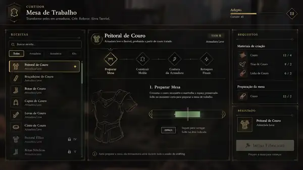

# Crafting UI — referências visuais e diretrizes de design

Status: referência normativa de apresentação para as interfaces de **Ferreiro** e **Curtidor**.

As imagens deste diretório registram a direção desejada de composição, hierarquia e fluxo da interface. Elas são **referências de UX/layout**, não arte final a ser copiada pixel a pixel.

## 1. Referências anexadas

### Curtidor

Arquivo: `assets/tanner-crafting-ui-reference.webp`

A referência demonstra:

- cabeçalho de profissão;
- lista de receitas à esquerda;
- detalhes e workflow no painel central;
- requisitos e resultado à direita;
- visualização clara das etapas `Preparar Mesa -> Construir Molde -> Costura -> Retoques Finais`;
- interação de minigame integrada ao mesmo painel;
- indicação de rank, categoria e requisitos sem abandonar a identidade visual do Aetherius.

### Ferreiro

Arquivo: `assets/blacksmith-crafting-ui-reference.webp`

A referência demonstra:

- catálogo de receitas;
- informação do item selecionado;
- sequência `Aquecer Forja -> Derreter Metal -> Moldar Metal -> Resfriar Peça`;
- requisitos materiais;
- ferramentas/workstation pertinentes;
- área de resultado;
- minigame apresentado dentro do workflow da receita.

## 2. Regra: não existem guildas de Ferreiro ou Curtidor

No Aetherius **não existe Guilda dos Ferreiros nem Guilda dos Curtidores**.

Consequentemente, a interface definitiva não pode conter:

- "Guilda dos Ferreiros";
- "Guilda dos Curtidores";
- rank de guilda;
- brasão de guilda inexistente;
- reputação com guilda inexistente;
- selo, título ou breadcrumb que faça a profissão parecer uma organização formal;
- qualquer texto do tipo "Membro da Guilda", "Oficial da Guilda" ou equivalente.

O cabeçalho pode e deve identificar a **profissão**:

~~~text
FERREIRO
Bancada de Criação
~~~

ou:

~~~text
CURTIDOR
Mesa de Trabalho
~~~

Isso é identidade de ofício, não identidade de guilda.

Restrições reais de membership de certas receitas continuam possíveis quando a **receita pertence a uma guilda externa existente no mundo**. Exemplo: equipamento de uma organização específica pode exigir membership daquela organização. Isso não cria uma Guilda de Ferreiros/Curtidores.

## 3. Aetherius UI Core é a autoridade visual

A implementação final deve usar os **design tokens, cores e linguagem visual do AetheriusUI_Core**.

As referências anexadas não são autoridade de cor.

Portanto:

- não copiar literalmente qualquer tom dourado, verde ou outro valor hexadecimal visto nas imagens;
- não criar uma paleta local exclusiva do CraftingSystem;
- não hardcodar cores que dupliquem tokens já existentes no Core;
- backgrounds, borders, highlights, texto, estados de foco, estados disabled e cores semânticas devem vir do AetheriusUI_Core;
- alterações futuras de tema do Core devem se propagar ao crafting sem reescrever o módulo.

O CraftingSystem fornece estrutura, estado e presentation metadata. O Core fornece a linguagem visual comum.

## 4. Elementos gráficos desenhados à mão

Os elementos gráficos próprios do crafting devem seguir uma estética **desenhada à mão**, coerente com o restante da direção artística do Aetherius.

Aplicar especialmente a:

- ilustrações de workstations;
- desenhos dos itens no painel central;
- ícones das etapas;
- símbolos de ferramentas;
- moldes;
- linhas ornamentais;
- separadores;
- pequenas marcas visuais da profissão.

A intenção é usar line art simples, artesanal e legível.

Evitar:

- renders 3D hiper-realistas;
- imagens excessivamente elaboradas;
- fotografias;
- ícones genéricos de biblioteca que quebrem a identidade;
- mistura de vários estilos de iconografia;
- ornamentos tão detalhados que prejudiquem implementação/legibilidade em CEF.

Os desenhos devem ser produzíveis e sustentáveis como assets reais de UI.

## 5. Estrutura visual recomendada

As referências validam uma composição em três grandes áreas:

~~~text
+------------------+-----------------------------+------------------+
| RECEITAS         | ITEM + PROCESSO             | REQUISITOS       |
|                  |                             |                  |
| busca/filtros    | cabeçalho do item           | materiais        |
| catálogo         | sequência de etapas         | ferramentas      |
| bloqueios        |                             |                  |
|                  | minigame/preview ativo      | RESULTADO        |
+------------------+-----------------------------+------------------+
~~~

Essa composição pode ser adaptada responsivamente, desde que preserve:

- leitura rápida;
- receita selecionada sempre evidente;
- etapas visíveis;
- requisitos separados de resultado;
- estados bloqueados compreensíveis;
- foco visual no processo atual.

## 6. Identidade de profissão

Ferreiro e Curtidor podem compartilhar a mesma arquitetura CEF, mas devem possuir presentation profiles próprios.

### Ferreiro

Pode utilizar:

- bigorna/forja/martelo em line art;
- representação artesanal de arma/armadura;
- linguagem de calor, metal e resfriamento;
- etapas próprias do workflow de ferraria.

### Curtidor

Pode utilizar:

- couro, agulha, molde e mesa em line art;
- desenho da peça de armadura leve;
- linguagem de preparação, molde, costura e acabamento;
- etapas próprias do workflow de curtimento.

A diferença é temática e funcional; não deve exigir dois frameworks de UI independentes.

## 7. Recipes, ranks e bloqueios

A interface pode exibir:

- rank exigido;
- categoria;
- materiais;
- disponibilidade;
- restrição de membership de organização real;
- gate Mestre;
- falta de recurso;
- workstation requirement.

Não deve usar perks vanilla como representação de progressão das profissões.

Um recipe acima do rank pode ser:

- ocultado; ou
- apresentado bloqueado.

A policy visual pode ser refinada depois, mas o servidor continua sendo authority.

## 8. Integração com Aetherius UI Core

A implementação deve:

- usar o shell existente;
- usar o UiTransportPort;
- usar os tokens do Core;
- respeitar lifecycle, focus e cursor do Core;
- evitar browser/CEF paralelo;
- reutilizar componentes-base quando compatíveis;
- manter estilos específicos do crafting dentro de limites definidos pelo sistema de tema.

Não duplicar o design system do Core dentro do módulo.

## 9. Assets de referência versus assets de produção

As duas imagens anexadas são **referências de implementação**.

Elas não devem ser tratadas como:

- background final;
- sprite final;
- screenshot embutida no jogo;
- fonte direta de ícones;
- obrigação de copiar todos os textos/cores.

A implementação final deve reconstruir os componentes de forma nativa em HTML/CSS/CEF e produzir seus próprios assets desenhados à mão.

## 10. Critérios de aceite visual

Antes de considerar a interface pronta:

1. nenhuma menção a Guilda dos Ferreiros/Curtidores;
2. profissão corretamente identificada no cabeçalho;
3. cores vêm do AetheriusUI_Core;
4. nenhum palette fork local;
5. ícones/ilustrações próprias seguem estética desenhada à mão;
6. receitas, processo, requisitos e resultado mantêm hierarquia clara;
7. Ferreiro e Curtidor possuem identidade temática sem duplicar framework;
8. UI não recebe recipes de outras profissões;
9. estados disabled/bloqueados usam padrões do Core;
10. screenshots de homologação são comparados com estas referências pela estrutura/UX, não por cópia pixel-perfect.
