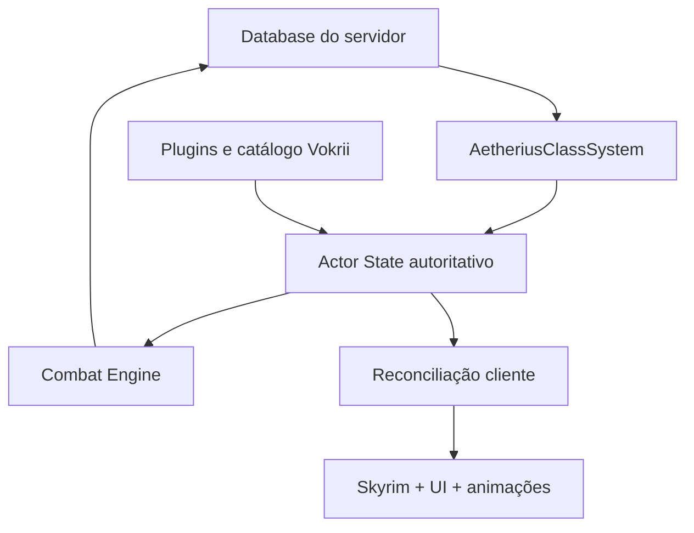
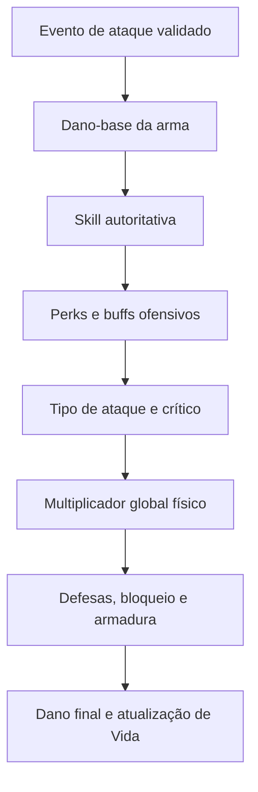
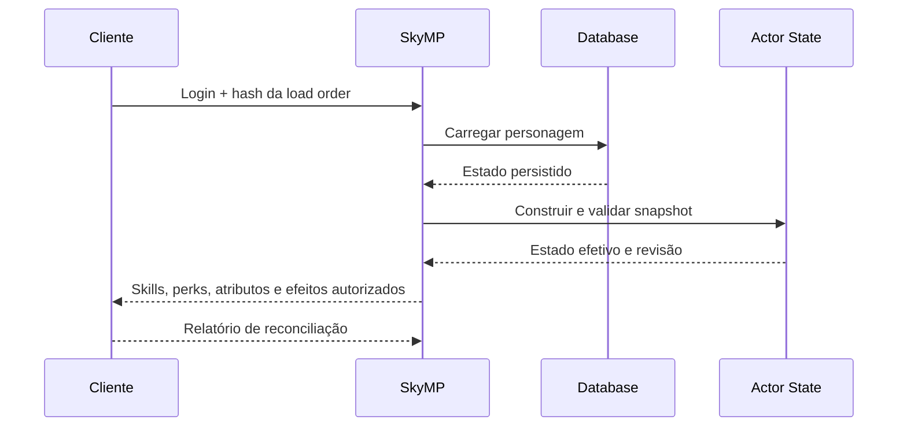

# Pesquisa técnica — Arquitetura de combate, estado autoritativo e integração SkyMP + AetheriusClassSystem + Vokrii

**Projeto:** Aetherius Roleplay  
**Data da pesquisa:** 20 de setembro de 2026  
**Objetivo:** consolidar a arquitetura necessária para tornar o servidor responsável por habilidades, perks, efeitos ativos, dano e resistências, preservando a integração com o motor de Skyrim, com o AetheriusClassSystem e com o mod Vokrii.

---

## 1. Resumo executivo

O Aetherius não deve tentar restaurar o leveling convencional de habilidades do Skyrim. Esse comportamento não existe no projeto e não é desejado. O nível de cada habilidade deve ser determinado exclusivamente pelo **AetheriusClassSystem**, de acordo com a classe, o nível da classe e os estágios configurados.

Ao mesmo tempo, o cliente não deve ser a autoridade sobre o dano. Mesmo com uma load order idêntica para todos os jogadores, o cliente continua passível de manipulação, dessincronização e instalação de componentes não autorizados. A padronização da load order reduz a complexidade de compatibilidade, mas não altera a fronteira de confiança.

A arquitetura recomendada é, portanto:

> **AetheriusClassSystem determina a progressão; o Actor State do SkyMP mantém o estado de combate; o servidor calcula as consequências; o cliente apresenta e reconcilia o resultado.**

O SkyMP já oferece uma base importante para isso. O servidor valida eventos de golpe, verifica equipamento e proximidade, calcula dano por meio de uma interface de fórmulas e altera o percentual de vida do alvo. Contudo, a fórmula atualmente chamada `TES5DamageFormula` ainda é uma aproximação incompleta:

- o dano físico parte essencialmente do dano-base da arma;
- o nível da habilidade ofensiva ainda não participa do cálculo;
- perks comuns e perks do Vokrii ainda não são processadas de forma geral;
- o bloqueio e o ataque furtivo usam multiplicadores simplificados;
- o dano mágico soma magnitudes hostis que afetam Vida, mas não reproduz adequadamente duração, concentração, resistência mágica, resistência elemental e absorção;
- o conjunto de Actor Values persistido é pequeno;
- efeitos ativos são persistidos de forma limitada e indexados por Actor Value, o que impede representar corretamente múltiplos efeitos simultâneos que atinjam o mesmo atributo;
- perks e níveis de habilidade não fazem parte do estado nativo persistente do ator.

O AetheriusClassSystem, por sua vez, já possui elementos reutilizáveis:

- 18 classes e progressão em estágios;
- XP e nível de classe;
- perks desbloqueadas;
- patamares de habilidades;
- distribuição de Vida, Mágicka e Vigor;
- persistência via `mp.get` e `mp.set`, com cache em memória;
- resolução de perks por plugin e Local Form ID;
- aplicação local de perks e Actor Values por Skyrim Platform.

Entretanto, o código atual ainda não representa a arquitetura final. Ele eleva uma habilidade apenas quando o valor local está abaixo da meta da classe, mantém autoria de perks somente em memória no cliente, aceita um fallback fictício de FormID em desenvolvimento e não possui um transporte SkyMP de ponta a ponta concluído. Esses pontos precisam ser corrigidos antes que o sistema de classes possa alimentar o combate autoritativo.

---

## 2. Escopo e base examinada

Esta pesquisa combina:

1. as decisões estabelecidas na conversa sobre o Aetherius;
2. inspeção do SkyMP upstream no commit `f926944b18e3aed4bc3864ce668626c05ec2545f`;
3. inspeção do AetheriusClassSystem no commit `c9d811f10524c27648db552f6185433df917f67d`;
4. descrição pública do Vokrii 3.8.2 e sua relação de perks;
5. os requisitos já definidos para o rework das fórmulas de dano e resistência.

O fork privado `mercurius17/skymp` não pôde ser lido sem autenticação nesta execução. Por isso, as conclusões sobre o núcleo partem do SkyMP upstream e das informações já fornecidas sobre o fork. Antes da implementação, deve ser produzido um diff entre o commit-base do fork e o upstream examinado, especialmente nas áreas de `MpActor`, change forms, fórmulas, carregamento de plugins e protocolo de mensagens.

Também não foi inspecionado o arquivo binário exato de `Vokrii - Minimalistic Perks of Skyrim.esp` usado pela load order do servidor. As descrições públicas são suficientes para classificar os tipos de mecânica, mas não para reproduzir com exatidão todas as condições, Entry Points, Magic Effects, keywords e scripts. A implementação definitiva exige extração dos registros da versão efetivamente distribuída aos jogadores.

---

## 3. Decisões arquiteturais já fechadas

### 3.1 O leveling comum de skills não existe

O jogador não deve aumentar One-Handed por atacar com espadas, Heavy Armor por receber golpes, Destruction por lançar magias ou qualquer outra habilidade por meio das ações convencionais do Skyrim.

Não existe:

- XP individual de habilidade;
- treinamento natural de skill;
- valor treinado separado da classe;
- progressão paralela ao AetheriusClassSystem.

Existe somente:

- classe escolhida;
- nível e XP da classe;
- estágio alcançado;
- valor exato de cada habilidade definido pelo sistema de classes;
- modificadores temporários, quando uma regra autorizada determinar que eles afetam o cálculo.

Consequentemente, não deve ser usado o modelo anteriormente cogitado de `trainedLevel`, `classMinimum` e `effectiveBaseLevel`. A skill da classe não é um mínimo: ela é o **valor-base autoritativo**.

### 3.2 O servidor é a autoridade sobre o combate

O cliente pode informar que ocorreu uma tentativa de ataque e fornecer dados observáveis necessários ao evento, mas não determina o dano definitivo nem o estado persistente do alvo.

O servidor deve controlar:

- identidade do atacante e do alvo;
- arma, magia ou fonte do dano;
- equipamento autorizado;
- classe, skills e perks;
- Vida, Mágicka e Vigor atuais e máximos;
- efeitos ativos e expiração;
- resistências;
- redução por armadura;
- RNG de procs e absorção;
- dano final;
- morte e recompensas derivadas.

O cliente permanece responsável por:

- animações;
- efeitos visuais e sonoros;
- interface;
- feedback local;
- aplicação local reconciliada das perks e skills autorizadas;
- predição apenas quando isso não altera o resultado autoritativo.

### 3.3 A load order é padronizada, mas o cliente não é confiável

Todos os jogadores usam a mesma load order. Isso permite:

- um catálogo único de armas, armaduras, magias, perks, keywords e efeitos;
- resolução determinística de registros;
- testes com uma instalação de referência;
- eliminação de matrizes de compatibilidade entre diferentes combinações de mods;
- geração de manifestos e hashes comuns.

Isso não permite aceitar cegamente valores de dano ou de atributos enviados pelo cliente. A load order precisa ser tratada como uma **entrada versionada do servidor**, não como prova de integridade do processo cliente.

### 3.4 A progressão e o combate devem consultar o mesmo estado

O AetheriusClassSystem não deve manter uma verdade sobre One-Handed, perks e atributos enquanto o motor de combate mantém outra. O sistema de classes publica alterações em um Actor State central, e o combate lê esse mesmo estado em memória.

---

## 4. Estado atual do SkyMP

### 4.1 O que o servidor já faz corretamente

O fluxo atual de `ActionListener::OnHit` já possui características de um servidor autoritativo:

- associa a conexão a um ator;
- valida se o agressor pode ser controlado por aquele usuário;
- resolve o alvo no mundo do servidor;
- rejeita agressor e alvo em células ou mundos diferentes;
- limita distância para ataques que não sejam disparos;
- impede ataque de ator morto;
- verifica se a magia está equipada;
- verifica se a arma está equipada ou se o golpe é desarmado;
- executa controles de frequência de golpe;
- calcula o dano no servidor;
- altera o percentual de Vida do alvo;
- sincroniza a mudança com os clientes.

Portanto, não é necessário inverter a arquitetura para que o cliente passe a calcular o combate. O ponto natural de expansão já existe no servidor.

### 4.2 Limitações da `TES5DamageFormula`

No snapshot analisado, `CalcWeaponRating()` retorna apenas o dano-base do registro `WEAP`. Há um `TODO` explícito indicando que faltam os outros componentes. A fórmula atual aplica, de forma simplificada:

```text
dano-base da arma
→ redução por armadura
→ ×2 se power attack
→ ×0,1 se bloqueado
→ ×1,3 se ataque furtivo
```

Também existem `TODOs` para multiplicador de dificuldade, fórmula correta de bloqueio e outros componentes.

Isso significa que o nome `TES5DamageFormula` não deve ser interpretado como garantia de paridade completa com o Skyrim vanilla. O próprio cabeçalho informa que partes podem estar ausentes.

### 4.3 Armadura atual

O SkyMP soma o `baseRatingX100` das peças `ARMO` vestidas e certos efeitos de encantamento cuja `primaryAV` é `DamageResist`. Depois usa os Game Settings `fArmorScalingFactor` e `fMaxArmorRating` para calcular a penalidade.

As lacunas mais relevantes são:

- efeitos gerais e perks que modificam armadura não estão plenamente integrados;
- não há arquitetura ampla de modificadores com fonte;
- debuffs temporários do Vokrii, como Denting Blows, não possuem representação geral;
- o cálculo atual não implementa a curva personalizada do Aetherius.

### 4.4 Dano mágico atual

A fórmula de magia percorre os efeitos do registro `SPEL` e soma a magnitude dos efeitos hostis ou prejudiciais cuja `primaryAV` seja `Health`.

Ela não representa de modo suficiente:

- resistência mágica;
- resistência a fogo, gelo e choque;
- absorção mágica;
- efeitos de dano por segundo;
- magias de concentração;
- combinação de múltiplos elementos;
- perks ofensivas e defensivas;
- condições e procs;
- efeitos secundários;
- regras completas de duração e acumulação.

Além disso, `OnSpellCast` contém um comentário explícito de que a aplicação de magic effects para certas magias ainda precisa ser implementada.

### 4.5 Actor Values atuais

O `ActorValues` nativo do SkyMP analisado contém:

- percentuais de Vida, Mágicka e Vigor;
- máximos de Vida, Mágicka e Vigor;
- taxas de regeneração;
- multiplicadores de regeneração.

Ele não contém a matriz necessária ao Aetherius, como:

- níveis das skills;
- armor rating efetivo;
- Magic Resist;
- Fire/Frost/Shock Resist;
- Spell Absorption;
- modificadores de dano por categoria;
- estado de perks.

### 4.6 Efeitos ativos atuais

O SkyMP possui `ActiveMagicEffectsMap`, serialização dos efeitos no change form e timers de expiração. Essa é uma base reutilizável, mas a estrutura atual é um mapa indexado por `ActorValue` e guarda apenas uma entrada para cada chave.

Esse modelo é insuficiente para o Skyrim e para o Vokrii porque vários efeitos podem:

- afetar o mesmo Actor Value ao mesmo tempo;
- ter fontes, magnitudes e durações diferentes;
- acumular, substituir ou coexistir de acordo com regras distintas;
- possuir condições sem modificar diretamente um Actor Value simples;
- aplicar pulsos periódicos;
- criar debuffs associados a um atacante e alvo específicos.

O código atual também limita a aplicação prática de efeitos a Vida, Mágicka, Vigor, regenerações e multiplicadores de regeneração. Isso confirma que não basta apenas adicionar novos campos à fórmula; é necessário expandir o sistema de efeitos.

### 4.7 Persistência atual do ator

O `MpChangeForm` persiste inventário, equipamentos, magias aprendidas, percentuais de recursos e efeitos ativos, entre outros dados. Não há, no snapshot analisado, persistência nativa de:

- perks adquiridas;
- ranks e fontes de perks;
- níveis das skills do Aetherius;
- resistências derivadas;
- estado condicional de perks.

Valores derivados não precisam ser todos persistidos, mas suas fontes autoritativas precisam.

### 4.8 Multiplicadores configuráveis existentes

O SkyMP já encadeia implementações de `IDamageFormula`:

1. `TES5DamageFormula`;
2. `DamageMultFormula`;
3. fórmulas específicas de SweetPie;
4. `DamageMultConditionalFormula`.

`DamageMultFormula` possui apenas um multiplicador voltado a dano de NPC contra jogador. Já `DamageMultConditionalFormula` aceita `physicalDamageMultiplier` e `magicDamageMultiplier` condicionais.

Essa arquitetura de composição pode ser preservada, mas o Aetherius precisa de dois multiplicadores globais explícitos e independentes, aplicáveis de modo previsível a todo dano físico e mágico. Eles não devem ser confundidos com o multiplicador de NPC contra jogador.

---

## 5. Estado atual do AetheriusClassSystem

### 5.1 Componentes aproveitáveis

O repositório analisado já possui:

- configuração externa de 18 classes;
- estágios de progressão;
- perks e habilidades liberadas por estágio;
- XP de classe, nível, cansaço e atributos;
- `PlayerRepository` com cache em memória e persistência por `mp.get`/`mp.set`;
- `PerkResolver`;
- `ClientPerkApplier`;
- regras de grupos e raids;
- UI PRISMA e uma alternativa baseada em Skyrim Platform.

A divisão conceitual entre servidor, cliente, shared e UI é adequada. O problema principal não é a ausência de regras de classe, mas a integração delas ao runtime real do SkyMP e ao futuro motor de combate.

### 5.2 O estado persistido hoje

`PlayerClassState` registra, entre outros campos:

- `classId` e `className`;
- `level`, `currentXp`, `nextLevelXp` e XP acumulado;
- pontos de atributo;
- atributos alocados;
- `unlockedPerks`;
- autorização de Winterhold;
- informações de party/raid;
- estado de cansaço;
- raça e atributos-base;
- `unlockedSkills`.

Essa estrutura é útil como ponto de partida, mas ainda mistura estado canônico, valores derivados e informações de sessão.

### 5.3 Skills hoje são “mínimos”, o que viola o requisito final

`resolveSkillsForClassAndLevel()` calcula o maior patamar encontrado até o estágio atual. No cliente, `syncSkills()` só chama `setActorValue()` quando o valor local é menor que a meta:

```ts
if (curVal < targetVal) {
  player.setActorValue(skillName, targetVal);
}
```

Esse comportamento implementa um piso, não autoridade estrita. Se o valor local subir por mecânica vanilla, comando, mod ou manipulação, ele permanecerá acima do nível autorizado.

Para atender à regra do Aetherius, a reconciliação deve usar o valor exato:

```text
skillBaseLocal := skillBaseAutorizadaPeloServidor
```

Além disso, toda skill gerenciada deve ter valor definido em todas as classes e estágios relevantes. Caso contrário, uma troca de classe pode deixar valores residuais da classe anterior.

### 5.4 O formato textual das skills deve ser substituído

Hoje a configuração utiliza textos como:

```json
"skills": "Destruição 40, Alteração 40, Restauração 40"
```

O parser também tenta inferir habilidades principais pelo nome das perks. Isso é frágil para um sistema que passará a alimentar diretamente o combate.

O formato recomendado é estruturado:

```json
"skills": {
  "Destruction": 40,
  "Alteration": 40,
  "Restoration": 40
}
```

Idealmente, cada estágio materializado deve produzir um snapshot completo das skills controladas, e não somente deltas textuais.

### 5.5 Perks hoje não possuem autoria persistente suficiente

`unlockedPerks` é uma lista de nomes. No cliente, `appliedPerks` é um `Map` em memória. Após reinício do script ou reconexão, o cliente pode perder a informação sobre quais perks foram aplicadas pelo sistema de classes.

Isso cria dois riscos:

- perks antigas não serem removidas após reset ou troca de classe;
- uma limpeza ampla remover perks que pertencem a raça, quest, vampirismo, staff ou outro sistema.

A solução é registrar cada concessão com sua fonte e reconciliar apenas o namespace controlado pelo Aetherius.

### 5.6 O fallback fictício de perks não pode existir em produção

Quando não resolve uma perk, o `PerkResolver` gera um FormID determinístico fictício, usa a estratégia `FALLBACK_MOCK` e marca `isResolved = true`.

Isso é aceitável para testes isolados, mas perigoso em produção. O servidor pode considerar que uma perk foi resolvida quando o registro real não existe.

Em produção:

- `FALLBACK_MOCK` deve ser proibido;
- perk não resolvida deve falhar de forma explícita;
- a inicialização deve produzir relatório de integridade;
- uma configuração incompleta deve impedir a ativação do módulo afetado ou a entrada do servidor em modo de produção.

### 5.7 A sincronização de atributos pode restaurar recursos indevidamente

O cliente atual chama `setActorValue('Health', health)`, e o mesmo para Mágicka e Vigor. É necessário separar:

- valor-base máximo;
- modificadores permanentes;
- modificadores temporários;
- valor atual.

Atualizar o máximo não pode curar o personagem ou restaurar recursos em combate. O servidor deve preservar o valor atual, ou o percentual atual, conforme a política definida.

### 5.8 Transporte e bridge ainda não estão concluídos

O `AUDIT.md` do projeto identifica que:

- o cliente usa APIs de transporte não correspondentes ao contrato documentado no SkyMP disponível;
- `handleClientPacket` não está registrado em um event source real;
- o plugin PRISMA abre a view, mas não forma sozinho a ponte completa UI ↔ servidor ↔ aplicação no ator;
- existem dois caminhos de UI que não devem ser ativados simultaneamente.

Portanto, o sistema de classes ainda não deve ser tratado como uma integração pronta para produção.

---

## 6. O papel do Vokrii

O Vokrii é um overhaul “vanilla-plus” de perks. Sua integração não consiste apenas em adicionar perks ao ator local. Muitas perks modificam o combate por meio de condições dinâmicas.

Exemplos confirmados na documentação pública da versão 3.8.2:

| Perk | Regra relevante ao servidor |
|---|---|
| One-Handed Mastery | Armas de uma mão causam 1% a mais de dano e 5% a mais de dano crítico por nível de One-Handed. |
| Furious Strength | Power attacks de uma mão causam 0,1% a mais de dano por ponto de Stamina. |
| Denting Blows | Maças reduzem a armadura do alvo em 100/150 por 10 segundos. |
| Far Shot | Armas à distância causam até 20/40% a mais de dano além de 60 pés, conforme a distância. |
| Wardancer | Ataques causam 20% a mais de dano e dano crítico usando somente armadura leve; um golpe não bloqueado desativa o efeito por 10 segundos. |
| Evasive Sprint | Durante sprint com armadura leve completa, o personagem recebe 50% menos dano de ataque. |

Esses exemplos demonstram que o servidor precisa conhecer não apenas a existência da perk, mas também:

- rank;
- skill associada;
- tipo e keywords da arma;
- tipo de ataque;
- Stamina atual ou valor exigido pela implementação exata;
- distância;
- peças equipadas;
- estado de sprint;
- bloqueio;
- histórico recente de golpes;
- debuffs ativos e sua origem;
- vida do alvo;
- direção do power attack;
- RNG de procs.

### 6.1 Categorias de perks para implementação

As perks devem ser classificadas antes de serem portadas:

| Categoria | Exemplo | Estratégia |
|---|---|---|
| Modificador estático | Mastery baseada em skill | Pré-calcular parte estática; aplicar na etapa ofensiva. |
| Condição do ataque | Power attack, sprint attack, sneak | Avaliar no evento de ataque. |
| Condição de equipamento | Armadura leve completa, arma específica | Consultar snapshot autoritativo de equipamento e keywords. |
| Condição espacial | Far Shot, Point Blank Shot | Calcular distância no servidor. |
| Estado temporal | Wardancer, debuffs de 10 s | Representar como estado/efeito com expiração. |
| Proc aleatório | Crítico, stagger, desarme | RNG exclusivo do servidor e proteção contra repetição. |
| Efeito no alvo | Denting Blows, sangramento, silêncio | Criar instância de efeito no alvo, com fonte e stacking. |
| Recurso/custo | Furious Strength, redução de Stamina | Consultar e alterar recurso autoritativo. |
| Visual ou qualidade de vida | Zoom, animação, interface | Pode permanecer no cliente, desde que não altere o resultado autoritativo. |

### 6.2 Descrição não substitui inspeção do plugin

O texto de uma perk não informa necessariamente:

- qual Entry Point é usado;
- qual condição interna é avaliada;
- se o valor usa Actor Value base, atual, permanente ou modificado;
- a ordem do modificador;
- keywords e exceções;
- scripts associados;
- comportamento exato com múltiplos efeitos.

Antes de implementar cada perk, deve-se extrair da versão exata do Vokrii:

- registro `PERK`;
- ranks;
- perk entries;
- conditions;
- `MGEF`, `SPEL` e scripts referenciados;
- keywords;
- FormIDs locais e EditorIDs;
- dependências de outros plugins da load order.

Essa extração pode ser feita previamente com xEdit e/ou por uma ferramenta baseada em libespm, gerando um catálogo versionado consumido pelo servidor e pelos testes.

---

## 7. Arquitetura integrada recomendada



### 7.1 Divisão de responsabilidades

| Componente | Responsabilidade |
|---|---|
| AetheriusClassSystem | Classe, nível de classe, XP, estágio, pontos, skills exatas e perks concedidas pela classe. |
| Actor State | Estado autoritativo em memória de atores: recursos, skills, perks, equipamento, efeitos e flags de combate. |
| Perk Registry | Identidade estável, rank, condições e handlers das perks suportadas. |
| Active Effect System | Instâncias, duração, stacking, dispel, pulsos, origem e persistência. |
| Combat Stats | Valores derivados e cache seletivo. |
| Damage Formula Engine | Pipeline de dano físico, mágico, bloqueio, crítico, resistência e absorção. |
| Persistência | Estado durável, versão do schema, revisão e migrações. |
| Cliente Skyrim | Apresentação, aplicação local reconciliada e captura de eventos não sensíveis. |

### 7.2 Onde implementar

O estado geral de combate e as fórmulas devem ser implementados no núcleo do fork do SkyMP, preferencialmente próximos de `MpActor`, change forms, `IDamageFormula` e `ActionListener`.

O AetheriusClassSystem deve continuar como módulo de domínio responsável pelas regras de progressão. Ele não deve se tornar o motor universal de combate, porque o mesmo estado também será necessário para:

- NPCs;
- criaturas;
- invocações;
- efeitos raciais;
- vampirismo e doenças;
- encantamentos;
- poções;
- sistemas administrativos;
- futuras progressões não baseadas em classe.

### 7.3 API mínima entre classes e núcleo

O núcleo deve expor operações de servidor equivalentes a:

```ts
setSkillBase(actorId, skill, exactValue, source, revision)
grantPerk(actorId, perkKey, rank, source, revision)
revokePerkSource(actorId, perkKey, source, revision)
setBaseAttributes(actorId, attributes, source, revision)
applyEffect(actorId, effectInstance)
removeEffect(actorId, effectInstanceId)
reconcileActorState(actorId, snapshot, revision)
getCombatSnapshot(actorId)
```

Atualizações de estágio devem ser aplicadas como lote atômico. Um level-up não pode persistir o novo nível e falhar antes de persistir as perks e skills correspondentes.

---

## 8. Modelo de dados proposto

### 8.1 Identidade persistente

O estado não deve depender de um `playerId` temporário de sessão. Deve existir um `characterId` persistente, associado à conta/perfil e ao personagem.

### 8.2 Estado canônico e valores derivados

```json
{
  "schemaVersion": 1,
  "revision": 184,
  "characterId": "char_1001",
  "classProgression": {
    "classId": "MESTRE_ESPADACHIM",
    "classLevel": 25,
    "classXp": 12000,
    "configVersion": "classes-2026-09-20"
  },
  "baseAttributes": {
    "health": 250,
    "magicka": 100,
    "stamina": 300
  },
  "skills": {
    "OneHanded": 60,
    "Block": 30,
    "LightArmor": 40
  },
  "perks": [
    {
      "perkKey": "Vokrii.esp:000800",
      "editorId": "EXAMPLE_EDITOR_ID",
      "rank": 1,
      "sources": [
        {
          "type": "CLASS",
          "sourceId": "MESTRE_ESPADACHIM:STAGE_6"
        }
      ]
    }
  ],
  "activeEffects": [
    {
      "instanceId": "effect_001",
      "effectKey": "Vokrii.esp:001234",
      "sourceActorId": "char_2002",
      "sourceType": "PERK",
      "magnitude": -150,
      "startedAt": "2026-09-20T15:00:00Z",
      "expiresAt": "2026-09-20T15:00:10Z",
      "stackingGroup": "ARMOR_REDUCTION_MACE",
      "stackingRule": "STRONGEST"
    }
  ]
}
```

Os IDs são ilustrativos.

### 8.3 O que persistir

Persistir:

- identidade e revisão;
- progressão de classe;
- versão da configuração usada;
- atributos-base e alocações;
- skills exatas ou dados suficientes para reconstruí-las deterministicamente;
- perks e fontes;
- efeitos permanentes;
- efeitos temporários que devam sobreviver a desconexão;
- recursos atuais, conforme a política de logout;
- cooldowns relevantes.

Recalcular:

- armor rating derivado das peças equipadas;
- resistência derivada de equipamentos;
- bônus de set;
- multiplicadores estáticos derivados das perks;
- estatísticas de combate em cache.

Não duplicar como efeito permanente um bônus que já pode ser reconstruído de uma fonte autoritativa, como uma armadura equipada.

### 8.4 Identidade de Forms

Não persistir somente o FormID completo de 32 bits. Ele incorpora a posição na load order e pode mudar.

Usar como identidade estável:

```text
plugin normal: nome do plugin + Local Form ID de 24 bits
plugin light:  nome do plugin + Local Form ID compatível com ESL
```

O FormID de runtime deve ser resolvido no carregamento a partir da load order validada.

---

## 9. Controle estrito de skills

### 9.1 Fonte única de verdade

Para cada personagem:

```text
SkillBase(skill) = valor definido pelo estágio atual da classe
```

Se existirem buffs temporários autorizados:

```text
SkillEfetiva(skill, contexto) = SkillBase(skill) + modificadores temporários aplicáveis
```

O modificador não altera o valor-base nem cria progressão permanente.

### 9.2 Como impedir progressão vanilla

São necessárias duas barreiras:

1. **Cliente:** impedir ou neutralizar a rotina que concede XP de skill. A solução robusta é um hook nativo controlado pelo pacote do servidor, ou outra intervenção centralizada que bloqueie `AdvanceSkill`/equivalente. Apenas corrigir o valor periodicamente pode deixar progress bars e eventos locais inconsistentes.
2. **Servidor:** nunca aceitar skill reportada pelo cliente como fonte de verdade. O cálculo consulta exclusivamente o Actor State autoritativo.

A reconciliação do cliente deve ocorrer:

- ao conectar;
- após carregar o ator;
- ao selecionar ou trocar classe;
- ao subir de estágio;
- após respawn quando necessário;
- quando uma verificação de integridade detectar divergência.

### 9.3 Mudança necessária no cliente atual

Substituir a lógica “somente elevar” por atribuição exata para todas as skills controladas. A reconciliação deve receber um snapshot completo e versionado.

Também deve existir uma política clara para skills que não pertencem à classe. A opção mais segura é o sistema de classes definir todas as skills administradas, inclusive seus valores-base, evitando resíduos após troca de classe.

---

## 10. Sistema de perks

### 10.1 Separar propriedade de execução

O estado deve responder a duas perguntas diferentes:

1. O ator possui a perk e em qual rank?
2. A condição da perk está ativa neste evento?

Ter One-Handed Mastery é permanente enquanto a fonte existir. O bônus aplicado a um golpe depende da skill e do tipo de arma. Wardancer pode estar adquirido, mas temporariamente desativado.

### 10.2 Fontes de concessão

Uma mesma perk pode vir de múltiplas fontes. A remoção de uma fonte não remove a perk se outra fonte ainda a concede.

Exemplos de fonte:

- `CLASS`;
- `RACE`;
- `QUEST`;
- `VAMPIRISM`;
- `ADMIN`;
- `EQUIPMENT`;
- `TEMPORARY_EFFECT`.

### 10.3 Catálogo e handlers

O servidor deve carregar um catálogo versionado:

```json
{
  "perkKey": "Vokrii - Minimalistic Perks of Skyrim.esp:LOCAL_ID",
  "editorId": "EDITOR_ID",
  "ranks": 2,
  "handler": "DENTING_BLOWS",
  "dependencies": ["weapon.keyword", "target.activeEffects"]
}
```

Não é necessário implementar todas as 162 perks cadastradas de uma vez. A priorização deve seguir as perks efetivamente concedidas pelas 18 classes, começando pelas que alteram dano, defesa, recursos e controle de combate.

### 10.4 Reconciliação cliente

O servidor envia o conjunto autorizado. O cliente:

- resolve o Form local;
- adiciona perks ausentes;
- remove somente perks cujo último vínculo gerenciado pelo Aetherius deixou de existir;
- devolve um relatório diagnóstico;
- não altera a verdade do servidor se falhar localmente.

Uma falha de aplicação deve ser visível em logs e métricas, pois pode causar diferença entre a apresentação local e o combate autoritativo.

---

## 11. Sistema de efeitos ativos

### 11.1 Estrutura necessária

O mapa atual por Actor Value deve evoluir para uma coleção de instâncias identificadas. Cada efeito precisa conter, quando aplicável:

- `instanceId`;
- Form estável da origem;
- ator de origem;
- alvo;
- magnitude;
- duração e expiração;
- intervalo de tick;
- stacking group;
- stacking rule;
- tags/elemento;
- condições;
- flags de persistência e dispel;
- modificadores produzidos;
- versão da regra.

### 11.2 Regras de stacking

O engine deve suportar ao menos:

- somar;
- manter o maior;
- manter o menor;
- substituir pela aplicação mais recente;
- renovar duração;
- acumular até N stacks;
- não acumular por mesma fonte;
- coexistir livremente.

Essas regras não podem ser inferidas apenas pelo Actor Value.

### 11.3 Tempo e desconexão

Timers não devem ser a única fonte de verdade. O efeito persiste `expiresAt`; o timer em memória é apenas o agendamento eficiente.

Na reconexão:

- efeitos expirados são descartados;
- efeitos persistentes são recriados com duração restante;
- efeitos derivados de equipamento são recalculados;
- estados que não devem sobreviver ao logout são removidos por política explícita.

---

## 12. Pipeline de dano físico

O pipeline recomendado deve ser explícito e testável:



### 12.1 Skill vanilla-like

Para armas, a progressão vanilla-like pode ser representada por:

\[
M_{skill}=1+0{,}005\times Skill
\]

Assim, skill 60 produz `1,30`, e skill 100 produz `1,50`.

O valor vem do AetheriusClassSystem, não do cliente.

### 12.2 Exemplo com Vokrii

Segundo a descrição do Vokrii, One-Handed Mastery concede 1% de dano adicional por nível de One-Handed:

\[
M_{mastery}=1+0{,}01\times OneHanded
\]

Com arma de dano-base 20 e One-Handed 60:

\[
D=20\times1{,}30\times1{,}60=41{,}6
\]

Esse exemplo considera apenas dano-base, skill e Mastery. A fórmula final ainda deve processar melhoria da arma, encantamentos, power attack, buffs, crítico, condições e defesa.

### 12.3 Ordem dos modificadores

A ordem exata deve ser congelada por especificação e por testes de referência. Recomenda-se separar:

1. valor-base do registro;
2. melhoria/temper da arma;
3. escala de skill;
4. perks estáticas;
5. modificadores condicionais;
6. power attack e crítico;
7. multiplicador global;
8. bloqueio e defesas do alvo;
9. armadura;
10. clamp e arredondamento.

Não se deve depender de ordem acidental entre decorators de `IDamageFormula`.

---

## 13. Fórmula personalizada de armadura do Aetherius

O requisito definido é:

- 500 de armadura = 80% de redução;
- 1.000 de armadura = 90% de redução;
- 1.000 é o hard cap;
- acima de 1.000, a redução permanece em 90%.

Uma função linear por trechos que atende exatamente a esses pontos é:

\[
R(A)=
\begin{cases}
0, & A\leq0\\
0{,}0016A, & 0<A\leq500\\
0{,}80+0{,}0002(A-500), & 500<A<1000\\
0{,}90, & A\geq1000
\end{cases}
\]

O dano após armadura é:

\[
D_{pós-armadura}=D_{pré-armadura}\times(1-R(A))
\]

| Armadura | Redução | Dano recebido de um golpe de 100 |
|---:|---:|---:|
| 0 | 0% | 100 |
| 100 | 16% | 84 |
| 250 | 40% | 60 |
| 500 | 80% | 20 |
| 750 | 85% | 15 |
| 1.000 | 90% | 10 |
| 1.500 | 90% | 10 |

### 13.1 Ordem com debuffs

Reduções como Denting Blows devem alterar a armadura efetiva antes da curva:

\[
A_{efetiva}=\max(0,A_{equipamento}+A_{buffs}-A_{debuffs})
\]

Depois aplica-se `R(Aefetiva)`.

### 13.2 Bônus oculto por peça

O Skyrim vanilla possui particularidades históricas no cálculo de armadura. Para que 500 e 1.000 tenham significado inequívoco no Aetherius, recomenda-se usar o valor efetivo explícito calculado pelo servidor, sem bônus oculto por peça, a menos que esse bônus seja deliberadamente reintroduzido e documentado.

---

## 14. Pipeline de dano mágico

O servidor deve resolver cada efeito de dano, e não apenas somar uma magnitude genérica do `SPEL`.

### 14.1 Classificação mínima

Cada efeito deve informar:

- escola;
- elemento: fogo, gelo, choque, mágico não elemental, veneno ou outro;
- modo de entrega;
- instantâneo, duração ou concentração;
- magnitude;
- duração;
- área;
- keywords;
- resist value aplicável;
- possibilidade de absorção;
- condições e perks modificadoras.

### 14.2 Resistência mágica e elemental

Para um efeito elemental, a forma vanilla-like esperada é multiplicativa:

\[
D_{resistido}=D\times(1-R_{mágica})\times(1-R_{elemental})
\]

Exemplo: 100 de dano de fogo, 25% de resistência mágica e 50% de resistência a fogo:

\[
100\times0{,}75\times0{,}50=37{,}5
\]

O cap vanilla de resistência normalmente tratado como referência é 85%, mas o valor, o piso para fraquezas e as exceções devem ser confirmados e expostos na configuração do Aetherius.

### 14.3 Absorção mágica

Absorção não deve ser tratada como simples redução percentual de dano. Ela é uma chance de absorver o efeito/magia conforme as regras do jogo.

O servidor deve:

1. calcular a chance autorizada;
2. executar o RNG no servidor;
3. decidir se o efeito foi absorvido;
4. impedir o dano/efeito quando absorvido;
5. restaurar Mágicka segundo a regra validada;
6. sincronizar o resultado visual ao cliente.

O comportamento exato para magias com múltiplos efeitos deve ser validado em uma instalação de referência.

### 14.4 Duração e concentração

Uma magia de `8 pontos por segundo` não pode ser resolvida como um único golpe de 8 se durar vários segundos. O Active Effect System precisa agendar ticks ou integrar dano por tempo de maneira determinística.

Magias de concentração exigem:

- início e fim do canal;
- frequência de tick definida;
- custo de Mágicka autoritativo;
- validação de alcance e linha de ação quando aplicável;
- interrupção;
- proteção contra pacotes repetidos.

---

## 15. Configuração global recomendada

O requisito de rebalanceamento global deve ser atendido por um arquivo dedicado e validado no startup:

```json
{
  "schemaVersion": 1,
  "global": {
    "physicalDamageMultiplier": 1.0,
    "magicDamageMultiplier": 1.0
  },
  "armor": {
    "softCapRating": 500,
    "softCapReduction": 0.80,
    "hardCapRating": 1000,
    "hardCapReduction": 0.90,
    "includeHiddenArmorPerPiece": false
  },
  "resistances": {
    "magicCap": 0.85,
    "elementalCap": 0.85,
    "allowWeaknessBelowZero": true
  },
  "effects": {
    "tickMilliseconds": 250,
    "persistTemporaryEffectsOnLogout": true
  },
  "production": {
    "allowMockFormResolution": false,
    "requireLoadOrderHashMatch": true
  }
}
```

Os multiplicadores globais devem ser aplicados uma única vez, em posição documentada do pipeline. Alterar o JSON não deve produzir multiplicação duplicada por decorators antigos.

---

## 16. Load order e integridade de registros

### 16.1 Manifesto comum

Na inicialização, gerar ou carregar um manifesto contendo:

- ordem dos plugins;
- tipo ESP/ESM/ESL;
- tamanho e hash do arquivo;
- versão conhecida;
- catálogo de Forms relevantes;
- versão do catálogo Vokrii;
- versão da configuração de classes;
- versão da fórmula de combate.

### 16.2 Handshake

Na conexão, o cliente envia o hash do manifesto local. O servidor:

- aceita somente correspondência exata, se essa for a política do Aetherius;
- registra divergências;
- não usa esse handshake como única proteção anticheat;
- nunca aceita FormID ou dano arbitrário sem resolução e validação próprias.

### 16.3 Benefício real da padronização

O maior benefício não é confiar no cliente. É permitir que o servidor carregue os mesmos registros via libespm e execute testes reproduzíveis com a mesma base de dados.

---

## 17. Fluxos principais

### 17.1 Login e reconexão



O cliente não envia valores de skill como autoridade. O relatório serve somente para diagnóstico.

### 17.2 Level-up da classe

```text
XP de classe autorizado
→ novo nível/estágio
→ resolver snapshot completo de skills
→ resolver perks e ranks
→ aplicar lote ao Actor State
→ persistir revisão
→ invalidar somente caches afetados
→ sincronizar cliente
```

### 17.3 Ataque

```text
evento de ataque
→ validar agressor, alvo, fonte, equipamento, posição e frequência
→ obter snapshots em RAM
→ construir contexto do ataque
→ aplicar skill e perks ofensivas
→ aplicar tipo de ataque, crítico e multiplicador global
→ aplicar bloqueio, perks defensivas, armadura ou resistências
→ executar efeitos/procs no servidor
→ atualizar Vida e demais recursos
→ persistir eventos relevantes
→ sincronizar resultado
```

---

## 18. Performance

O banco de dados não deve ser consultado a cada ataque.

### 18.1 Estado quente em memória

Ao conectar, o personagem é carregado para RAM. O combate consulta diretamente:

- skills;
- perks;
- recursos;
- equipamento;
- resistências;
- efeitos;
- cache de estatísticas.

### 18.2 Invalidação seletiva

Exemplos:

- adquirir One-Handed Mastery invalida estatísticas de uma mão, não resistência a fogo;
- trocar uma armadura invalida armor rating, conjuntos e encantamentos daquela peça;
- aplicar Fortify One-Handed invalida o cálculo ofensivo correspondente;
- Denting Blows invalida a armadura efetiva do alvo até expirar;
- alterar classe invalida todo o snapshot de skills e perks gerenciado pela classe.

### 18.3 Persistência

Persistir em eventos relevantes, com write-behind controlado quando seguro:

- level-up;
- troca/reset de classe;
- alocação de atributos;
- concessão/revogação de perk;
- aplicação/remoção de efeito persistente;
- logout;
- checkpoints periódicos.

Usar revisão monotônica e operações idempotentes evita duplicidade após repetição de pacotes ou retry.

---

## 19. Segurança e validação

### 19.1 Dados que o cliente pode declarar

O cliente pode declarar intenção e observações necessárias, como:

- tentou atacar;
- fonte aparente;
- flags de animação;
- início/fim de canalização;
- alvo selecionado.

O servidor precisa validar tudo que influencia consequência.

### 19.2 Dados que não devem ser aceitos como verdade

- dano calculado;
- skill;
- perk adquirida;
- resistência;
- armor rating;
- efeito ativo;
- Vida final;
- Stamina disponível;
- morte válida;
- recompensa de XP.

### 19.3 Expansão de protocolo

Algumas perks exigem informações que o `HitMessage` atual não contém ou não autentica suficientemente, como direção do power attack, estado de sprint, draw completo e certos estados de animação.

Quando a condição não puder ser derivada do estado do servidor, o protocolo pode ser expandido, mas cada novo campo deve ser:

- limitado por estados possíveis;
- validado contra animação, tempo e equipamento;
- tratado como evidência, não como autoridade isolada;
- coberto por rate limit e testes de replay.

---

## 20. Plano de implementação

### Fase 0 — Congelamento e auditoria

- identificar o commit-base real do fork;
- produzir diff contra o upstream;
- congelar a versão exata da load order e do Vokrii;
- extrair registros relevantes;
- mapear todas as perks concedidas pelas 18 classes;
- classificar perks por complexidade e dependências.

### Fase 1 — Actor State e schema

- criar identidade persistente de personagem;
- versionar schema;
- adicionar skills exatas;
- adicionar perks com rank e fontes;
- separar recursos atuais e máximos;
- substituir a coleção limitada de efeitos;
- criar cache de Combat Stats;
- implementar migrações.

### Fase 2 — Integração do AetheriusClassSystem

- converter configuração textual de skills em estrutura tipada;
- fazer cada estágio produzir snapshot completo;
- proibir progressão vanilla;
- adaptar o sistema para publicar lotes autoritativos no Actor State;
- remover `FALLBACK_MOCK` de produção;
- concluir um único transporte UI/cliente/servidor;
- reconciliar login, level-up, reset e troca de classe.

### Fase 3 — Dano físico e armadura

- completar weapon rating;
- incorporar skills autoritativas;
- implementar curva 500/80% e 1.000/90%;
- adicionar multiplicador físico global;
- corrigir bloqueio, furtividade e críticos;
- implementar primeiras perks Vokrii ofensivas e defensivas;
- criar golden tests.

### Fase 4 — Magia e efeitos

- classificar efeitos por elemento e delivery;
- implementar resistência mágica e elemental;
- implementar absorção;
- suportar duração e concentração;
- adicionar multiplicador mágico global;
- integrar poções, encantamentos, buffs e debuffs;
- persistir efeitos conforme política.

### Fase 5 — Cobertura Vokrii

- implementar perks por árvore e prioridade de classe;
- adicionar handlers de proc, stagger, bleed, silêncio, desarme e execução;
- validar cada perk contra instalação de referência;
- registrar divergências conhecidas quando a paridade literal não for viável.

### Fase 6 — Hardening

- handshake de manifestos;
- validação de protocolo;
- proteção contra replay;
- telemetria e logs de cálculo;
- soak tests com grupos e raids;
- testes de reconexão e crash recovery;
- ferramentas administrativas de inspeção do Actor State.

---

## 21. Testes e critérios de aceitação

### 21.1 Skills

- usar uma arma nunca aumenta permanentemente a skill;
- após login, a skill local coincide exatamente com o snapshot do servidor;
- manipular a skill no cliente não altera o dano do servidor;
- troca de classe remove valores residuais;
- level-up altera a skill somente no estágio correto.

### 21.2 Perks

- perk de classe reaparece após reconexão;
- reset remove apenas a fonte de classe;
- perk com outra fonte permanece;
- Form não resolvido falha em produção;
- rank correto é usado no cálculo;
- cliente sem aplicação local não altera a posse autoritativa, mas gera alerta.

### 21.3 Armadura

- AR 0 → 0% de redução;
- AR 500 → 80%;
- AR 1.000 → 90%;
- AR acima de 1.000 → 90%;
- debuff de armadura é aplicado antes da curva;
- expiração do debuff restaura o valor correto;
- valores negativos são normalizados conforme regra.

### 21.4 Magia

- resistência mágica e elemental acumulam multiplicativamente;
- elemento correto é selecionado por efeito;
- absorção usa RNG do servidor;
- DoT causa o total e os ticks esperados;
- concentração termina quando interrompida;
- efeitos com mesma AV coexistem conforme stacking;
- buffs de equipamento desaparecem ao desequipar.

### 21.5 Vokrii

- One-Handed Mastery escala com a skill da classe;
- Furious Strength usa o Actor Value definido pela implementação verificada;
- Denting Blows aplica rank, magnitude e 10 segundos corretos;
- Far Shot usa distância do servidor;
- Wardancer é desativada por golpe não bloqueado e reativada após 10 segundos;
- Evasive Sprint exige equipamento e sprint válidos;
- RNG e críticos são reproduzíveis em testes por seed.

### 21.6 Segurança

- arma não equipada não causa dano;
- pacote repetido não duplica dano;
- ataque fora de alcance é rejeitado;
- dano reportado pelo cliente é ignorado;
- skill/perk/effect forjados são ignorados;
- load order divergente é rejeitada conforme configuração;
- evento de morte e XP deriva do servidor.

### 21.7 Performance

- nenhum acesso ao banco no hot path de cada hit;
- cálculo permanece dentro do orçamento definido sob combate em grupo/raid;
- expiração de efeitos não cria crescimento ilimitado de timers;
- caches são invalidados corretamente;
- reinício do servidor reconstrói estado sem duplicar efeitos.

---

## 22. Principais riscos

| Risco | Impacto | Mitigação |
|---|---|---|
| Reproduzir Vokrii apenas pelas descrições | Fórmulas e condições incorretas | Extrair registros e scripts da versão exata. |
| Duplicar estado entre TS e C++ | Divergência entre classe e combate | Um Actor State canônico, revisões e comandos atômicos. |
| Manter `syncSkills` como piso | Exploit e dano incorreto | Atribuição exata e bloqueio de XP vanilla. |
| Usar FormID completo persistido | Quebra após mudança de load order | Plugin + Local Form ID + resolução de runtime. |
| Aceitar fallback mock | Perks inexistentes consideradas válidas | Proibir em produção e falhar no startup. |
| Active effects por Actor Value | Efeitos sobrescritos e stacking incorreto | Coleção por instância e stacking group. |
| Recalcular tudo a cada hit | Custo desnecessário | Cache seletivo em RAM. |
| Consultar database a cada hit | Latência e gargalo | Carregamento no login e persistência por eventos. |
| Confiar em flags do cliente | Exploits de contexto | Derivação e validação server-side. |
| Atualizar máximos com `setActorValue` | Cura/restauração indevida | Separar base, máximo, atual e percentual. |
| Implementar todas as perks de uma vez | Escopo difícil de testar | Priorizar perks usadas pelas classes. |

---

## 23. Conclusão

A expansão correta não é uma simples troca de fórmula. Ela exige um estado de ator mais completo e compartilhado por progressão, persistência e combate.

O caminho recomendado é:

1. manter o cálculo definitivo de dano no servidor SkyMP;
2. transformar o AetheriusClassSystem na única autoridade sobre o valor-base das skills;
3. persistir perks com rank e fonte;
4. substituir o modelo limitado de active effects por instâncias acumuláveis;
5. fazer o Combat Engine consultar o Actor State em RAM;
6. implementar a curva personalizada de armadura;
7. adicionar resistências e absorção vanilla-like;
8. portar o Vokrii por handlers verificados contra o plugin real;
9. usar o cliente somente para apresentação, captura de eventos e reconciliação;
10. validar todo o sistema com uma instalação de referência que use a load order oficial.

A load order uniforme torna essa arquitetura viável e testável. O AetheriusClassSystem fornece a progressão planejada. O SkyMP já fornece o ponto de autoridade do combate. O trabalho principal é unir essas duas bases por um Actor State robusto e, sobre ele, reproduzir de maneira explícita e verificável as regras vanilla e do Vokrii.

---

## 24. Referências técnicas

### SkyMP

- Repositório upstream: <https://github.com/skyrim-multiplayer/skymp>
- Snapshot examinado: <https://github.com/skyrim-multiplayer/skymp/tree/f926944b18e3aed4bc3864ce668626c05ec2545f>
- Fórmula TES5: <https://github.com/skyrim-multiplayer/skymp/blob/f926944b18e3aed4bc3864ce668626c05ec2545f/skymp5-server/cpp/server_guest_lib/formulas/TES5DamageFormula.cpp>
- Processamento de golpes: <https://github.com/skyrim-multiplayer/skymp/blob/f926944b18e3aed4bc3864ce668626c05ec2545f/skymp5-server/cpp/server_guest_lib/ActionListener.cpp>
- Actor Values: <https://github.com/skyrim-multiplayer/skymp/blob/f926944b18e3aed4bc3864ce668626c05ec2545f/skymp5-server/cpp/server_guest_lib/ActorValues.h>
- Active effects: <https://github.com/skyrim-multiplayer/skymp/blob/f926944b18e3aed4bc3864ce668626c05ec2545f/skymp5-server/cpp/server_guest_lib/ActiveMagicEffectsMap.h>
- Change forms: <https://github.com/skyrim-multiplayer/skymp/blob/f926944b18e3aed4bc3864ce668626c05ec2545f/skymp5-server/cpp/server_guest_lib/MpChangeForms.h>
- Composição das fórmulas: <https://github.com/skyrim-multiplayer/skymp/blob/f926944b18e3aed4bc3864ce668626c05ec2545f/skymp5-server/cpp/addon/ScampServer.cpp>
- Multiplicadores condicionais: <https://github.com/skyrim-multiplayer/skymp/blob/f926944b18e3aed4bc3864ce668626c05ec2545f/skymp5-server/cpp/server_guest_lib/formulas/DamageMultConditionalFormula.cpp>

### AetheriusClassSystem

- Repositório: <https://github.com/mercurius17/AetheriusClassSystem>
- Snapshot examinado: <https://github.com/mercurius17/AetheriusClassSystem/tree/c9d811f10524c27648db552f6185433df917f67d>
- Tipos e estado do jogador: <https://github.com/mercurius17/AetheriusClassSystem/blob/c9d811f10524c27648db552f6185433df917f67d/shared/types.ts>
- Persistência: <https://github.com/mercurius17/AetheriusClassSystem/blob/c9d811f10524c27648db552f6185433df917f67d/server/storage/playerRepository.ts>
- Resolução de skills: <https://github.com/mercurius17/AetheriusClassSystem/blob/c9d811f10524c27648db552f6185433df917f67d/shared/skillResolver.ts>
- Aplicação no cliente: <https://github.com/mercurius17/AetheriusClassSystem/blob/c9d811f10524c27648db552f6185433df917f67d/client/clientPerkApplier.ts>
- Resolução de perks: <https://github.com/mercurius17/AetheriusClassSystem/blob/c9d811f10524c27648db552f6185433df917f67d/shared/perkResolver.ts>
- Auditoria do projeto: <https://github.com/mercurius17/AetheriusClassSystem/blob/c9d811f10524c27648db552f6185433df917f67d/AUDIT.md>

### Vokrii

- Página oficial do mod e lista pública de perks, versão 3.8.2: <https://www.nexusmods.com/skyrimspecialedition/mods/26176>

---

## 25. Nota de verificação

Os arquivos JSON do AetheriusClassSystem foram sincronizados com sucesso durante esta pesquisa: 18 classes, 162 descrições de perks, 162 mapeamentos de perks e 149 descrições de feitiços foram reconhecidos pelo script do projeto. A compilação TypeScript e os testes Jest não foram executados até o fim porque as dependências de desenvolvimento (`typescript` e `jest`) não estavam instaladas no ambiente clonado. Isso não altera as conclusões da inspeção estática, mas a implementação deve começar por instalação reproduzível das dependências e execução integral de build e testes.
